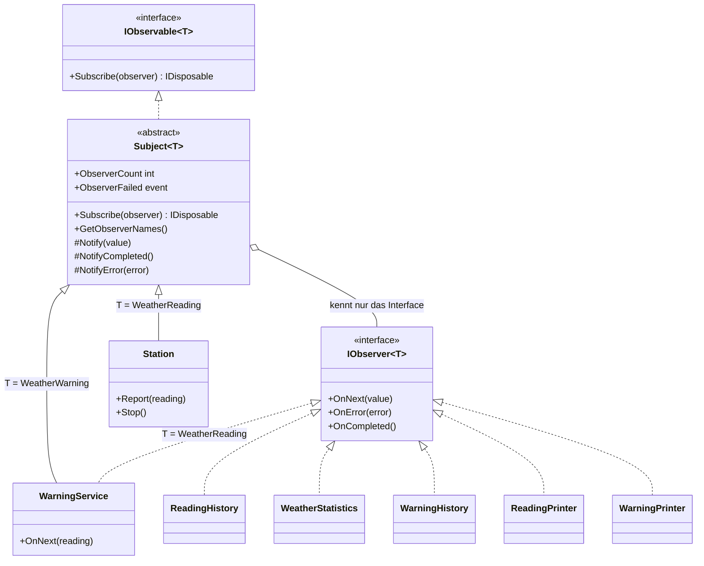
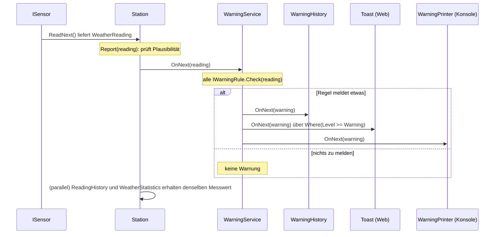
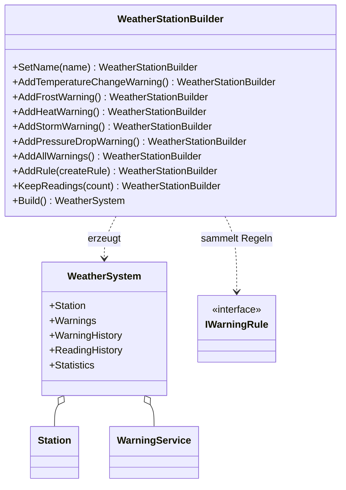
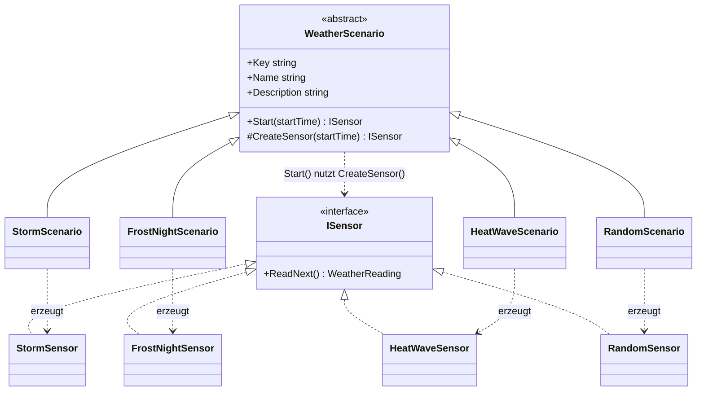
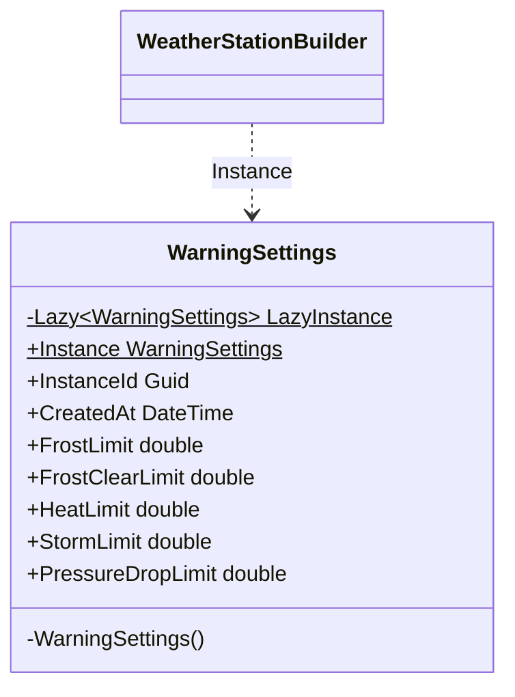

# Wetterstation – Lernskript zu Design Patterns

Hallo! Dieses Projekt ist ein Lernbegleiter für dich. Du lernst hier vier **Entwurfsmuster** (englisch: *Design Patterns*) an einem Beispiel kennen, das du sofort anfassen kannst:

| Muster | Kurz gesagt | Schwerpunkt? |
|---|---|---|
| **Observer** | „Sag mir Bescheid, wenn sich etwas ändert.“ | ja, ausführlich |
| **Builder** | „Baue mir ein komplexes Objekt Schritt für Schritt zusammen.“ | |
| **Factory Method** | „Die Unterklasse entscheidet, welches Objekt entsteht.“ | |
| **Singleton** | „Es gibt genau eine Instanz.“ | |

Ein Entwurfsmuster ist eine bewährte Lösung für ein Problem, das in der Softwareentwicklung immer wieder vorkommt. Es ist kein fertiger Code zum Kopieren, sondern eine **Idee**, die du in deine Klassen übersetzt.

## Inhalt

1. [Worum geht's?](#1-worums-geht)
2. [Schnellstart](#2-schnellstart)
3. [Projektstruktur](#3-projektstruktur)
4. [Die Patterns](#4-die-patterns)
   - [4.1 Observer](#41-observer-beobachter)
   - [4.2 Builder](#42-builder)
   - [4.3 Factory Method](#43-factory-method)
   - [4.4 Singleton](#44-singleton)
5. [Observer-Labor](#5-observer-labor)
6. [Übungsaufgaben](#6-übungsaufgaben)
7. [Bewusste Vereinfachungen und Glossar](#7-bewusste-vereinfachungen)

---

## 1. Worum geht's?

Stell dir eine kleine **Wetterstation** vor. Sie misst regelmäßig:

- Temperatur (°C)
- Luftfeuchte (%)
- Luftdruck (hPa)
- Windgeschwindigkeit (km/h)

Aus diesen Messwerten erzeugt das Programm **Warnungen**:

| Warnung | Wann? |
|---|---|
| Temperaturänderung | Die Temperatur hat sich um mindestens 3 °C geändert |
| Frost | Temperatur <= 0 °C |
| Hitze | Temperatur >= 30 °C |
| Sturm | Wind >= 75 km/h |
| Luftdruckabfall | Der Druck fällt um mindestens 3 hPa innerhalb von 3 Stunden |

Damit du nicht auf echtes Wetter warten musst, gibt es **Szenarien**: Sturmfront, Frostnacht, Hitzewelle und Zufallswetter. Ein simulierter Sensor liefert dann passende Messwerte.

### Zwei Oberflächen, ein Kern

Du kannst wählen, womit du dich wohler fühlst:

- **Konsole** (`WeatherStation.ConsoleApp`): Text, Farben, Tastensteuerung.
- **Web-App mit Blazor** (`WeatherStation.Web`): Diagramme, Tabellen, Benachrichtigungen im Browser.

Beide nutzen **denselben Kern** (`WeatherStation.Core`). Der Kern weiß nichts davon, ob er in einer Konsole oder in einem Browser läuft. Genau das ist der Nutzen der Patterns: Die Station meldet Messwerte, und jede Oberfläche hängt sich einfach dran. Keine Zeile im Kern musste dafür angepasst werden.

---

## 2. Schnellstart

### Voraussetzungen

- **.NET 10 SDK** (`dotnet --version` sollte 10.x anzeigen).
- **Node.js** brauchst du nur, wenn du das Aussehen (CSS) der Web-App ändern willst. Die fertige Datei `src/WeatherStation.Web/wwwroot/css/site.out.css` liegt schon bei. Wenn du `site.css` änderst, baust du sie neu mit `npm install` und `npm run build:css` (siehe `package.json`).

### Konsole starten

```bash
dotnet run --project src/WeatherStation.ConsoleApp
```

Du wählst im Menü ein Szenario (Zahl eingeben, `0` = Beenden). Dann kommt alle 700 ms ein Messwert. Während die Simulation läuft:

| Taste | Wirkung |
|---|---|
| `P` | Pause / Weiter |
| `S` | Statistik anzeigen |
| `U` | Messwert-Anzeige **ab**- bzw. wieder **an**melden (zeigt `Dispose`!) |
| `Q` | Zurück zum Menü (die Station wird gestoppt) |

### Web-App starten

```bash
dotnet run --project src/WeatherStation.Web
```

Die Adresse steht in `src/WeatherStation.Web/Properties/launchSettings.json`:

- Profil `http`: <http://localhost:5239>
- Profil `https`: <https://localhost:7209> (und zusätzlich http://localhost:5239)

Mit `dotnet run` wird das Profil `http` benutzt. Der Browser öffnet sich in der Regel von selbst. Die Seiten:

| Adresse | Seite |
|---|---|
| `/` | Übersicht: Kennzahlen, Szenario wählen, Diagramm, letzte Warnungen |
| `/warnungen` | Alle Warnungen als Tabelle, live |
| `/observer-labor` | Zum Experimentieren mit dem Observer-Muster (siehe [Kapitel 5](#5-observer-labor)) |
| `/muster` | Kurzüberblick über die Patterns inkl. Singleton-Nachweis und Grenzwerte |

### Tests ausführen

```bash
dotnet test
```

Die Tests liegen in `tests/WeatherStation.Tests`. Sie sind auch eine gute Dokumentation: Sie zeigen, wie man die Klassen benutzt.

---

## 3. Projektstruktur

```text
WeatherStation/
├── docs/PLAN.md                     Umsetzungsplan (für Lehrende / Neugierige)
├── src/
│   ├── WeatherStation.Core/         DER KERN – keine UI-Abhängigkeit
│   │   ├── Models/                  WeatherReading, WeatherWarning, WarningLevel, WarningType
│   │   ├── Observer/                Observer-Baukasten: Subject<T>, ActionObserver<T>,
│   │   │                            ObservableExtensions (Subscribe/Where), INamedObserver, ObserverError
│   │   ├── Observers/               Fertige Observer: WarningHistory, ReadingHistory, WeatherStatistics
│   │   ├── Services/                Station (Subject) und WarningService (Observer + Subject)
│   │   ├── Rules/                   IWarningRule + FrostRule, HeatRule, StormRule,
│   │   │                            TemperatureChangeRule, PressureDropRule
│   │   ├── Building/                WeatherStationBuilder (Builder) und WeatherSystem (Produkt)
│   │   ├── Scenarios/               WeatherScenario (Factory Method), Storm-/Frost-/HeatWave-/RandomScenario,
│   │   │   │                        ScenarioCatalog, ISensor
│   │   │   └── Sensors/             Die konkreten Sensoren (internal): CycleSensor, StormSensor, ...
│   │   └── Settings/                WarningSettings (Singleton)
│   ├── WeatherStation.ConsoleApp/   Konsole
│   │   ├── Program.cs               Startpunkt (kurz)
│   │   ├── WeatherConsole.cs        Menü und Simulationsschleife
│   │   └── Observers/               ReadingPrinter, WarningPrinter
│   └── WeatherStation.Web/          Blazor Server
│       ├── Program.cs               Dienste registrieren (Builder + Singleton)
│       ├── Services/SimulationRunner.cs   Hintergrunddienst: alle 1,5 s ein Messwert
│       └── Components/
│           ├── Pages/               Home, Warnings, ObserverLab, Patterns
│           └── Shared/WarningToaster.razor   Toast-Benachrichtigungen (Observer mit Filter)
└── tests/WeatherStation.Tests/      xUnit-Tests für den Kern
```

Merke dir diese Regel: **Der Kern (`Core`) kennt keine Oberfläche. Die Oberflächen kennen den Kern.** Die Abhängigkeit zeigt nur in eine Richtung.

---

## 4. Die Patterns

### 4.1 Observer (Beobachter)

#### Problem aus dem Alltag

Du willst wissen, wenn dein Lieblings-YouTuber ein neues Video hochlädt. Du könntest alle fünf Minuten nachschauen. Das nervt und kostet Zeit. Besser: Du **abonnierst** den Kanal. Sobald es etwas Neues gibt, bekommst du eine Nachricht. Wenn du keine Lust mehr hast, **kündigst** du das Abo.

Der YouTuber muss dafür nicht wissen, wer alles zuschaut oder was die Zuschauer mit dem Video machen. Er meldet nur: „Neues Video da!“

Bei uns: Die **Station** ist der Kanal, der Messwerte „veröffentlicht“. Die **Bildschirmanzeige**, die **Statistik** und der **Warn-Dienst** sind Abonnenten.

Ohne das Muster müsste die Station jeden Empfänger kennen und aufrufen:

```csharp
// So NICHT: Die Station kennt alle und muss bei jedem neuen Empfänger geändert werden.
void Report(WeatherReading reading)
{
    screen.Show(reading);
    statistics.Add(reading);
    warningService.Check(reading);
    // ... und was, wenn morgen ein CSV-Logger dazukommt?
}
```

#### Die Idee in einem Satz

Ein **Subject** führt eine Liste von **Observern** und benachrichtigt sie alle automatisch, wenn sich etwas ändert, ohne sie näher zu kennen.

#### Rollen

| GoF-Rolle | Bedeutung | Klasse in diesem Projekt |
|---|---|---|
| Subject (Observable) | Wird beobachtet, verwaltet die Abonnenten | `Subject<T>` (Basisklasse), `Station`, `WarningService` |
| Observer | Will benachrichtigt werden | `IObserver<T>` (aus .NET) |
| Konkreter Observer | Reagiert auf die Meldung | `WarningHistory`, `ReadingHistory`, `WeatherStatistics`, `ReadingPrinter`, `WarningPrinter`, `ActionObserver<T>`, die Blazor-Seiten |
| Anmelden | Abonnieren | `Subscribe(observer)` |
| Abmelden | Kündigen | `Dispose()` auf dem zurückgegebenen Token |
| Benachrichtigen | Alle Abonnenten informieren | `Notify(value)` in `Subject<T>` |

#### Klassendiagramm



Wichtig: `Subject<T>` kennt seine Observer **nur über das Interface** `IObserver<T>`. Deshalb kann jede neue Klasse zuhören, ohne dass die Station geändert wird. Das nennt man **lose Kopplung**.

#### Code-Auszug

Das Subject (`src/WeatherStation.Core/Observer/Subject.cs`) benachrichtigt eine Momentaufnahme seiner Observer:

```csharp
protected void Notify(T value)
{
    IObserver<T>[] snapshot;
    lock (_lock)
    {
        if (_isCompleted)
        {
            return;
        }
        _lastValue = value;
        _hasLastValue = true;
        snapshot = _observers;
    }

    // Außerhalb des locks: Observer dürfen sich selbst abmelden.
    foreach (IObserver<T> observer in snapshot)
    {
        DeliverToOne(observer, value);
    }
}
```

Und so einfach meldet die Station einen Messwert (`src/WeatherStation.Core/Services/Station.cs`):

```csharp
public void Report(WeatherReading reading)
{
    // ... Prüfungen (Station gestoppt? Werte plausibel?) ...
    lock (_stateLock)
    {
        _lastReading = reading;
        _readingCount++;
    }

    Notify(reading);
}
```

Und so hörst du zu (`src/WeatherStation.ConsoleApp/WeatherConsole.cs`):

```csharp
var readingPrinter = new ReadingPrinter();
IDisposable? readingSubscription = system.Station.Subscribe(readingPrinter);
// ... später:
readingSubscription.Dispose();   // Abo kündigen
```

#### Ablauf: Ein Messwert wandert durchs System



Die Station kennt weder die Historie noch den Toast. Sie kennt nur `IObserver<WeatherReading>`.

`Toast` (Web) und `WarningPrinter` (Konsole) laufen nie gleichzeitig im selben Programm. Sie stehen hier zusammen, um zu zeigen, dass **beliebig viele** Observer gleichzeitig zuhören können.

#### Die Kette: `WarningService` ist Observer und Subject

Schau dir `src/WeatherStation.Core/Services/WarningService.cs` an:

```csharp
public sealed class WarningService : Subject<WeatherWarning>, IObserver<WeatherReading>, INamedObserver
```

- Als **Observer** von `WeatherReading` bekommt er die Messwerte der Station (`OnNext`).
- Als **Subject** von `WeatherWarning` meldet er erzeugte Warnungen an seine eigenen Abonnenten weiter.

```mermaid
flowchart LR
    S[Station<br/>Subject von WeatherReading] -->|Messwert| W[WarningService<br/>Observer UND Subject]
    W -->|Warnung| H[WarningHistory]
    W -->|Warnung| T[Toast / Konsole]
    S -->|Messwert| R[ReadingHistory]
    S -->|Messwert| X[WeatherStatistics]
```

So entsteht eine **Kette**: Jedes Glied kennt nur das nächste über ein Interface. Ein Zwischenglied kann später ausgetauscht oder erweitert werden.

#### `IObservable<T>` und `IObserver<T>` aus .NET

Du musst das Muster nicht selbst erfinden: .NET bringt die Interfaces mit.

```csharp
public interface IObservable<out T> { IDisposable Subscribe(IObserver<T> observer); }

public interface IObserver<in T>
{
    void OnNext(T value);        // ein neuer Wert
    void OnError(Exception error); // die Quelle ist kaputt, es kommt nichts mehr
    void OnCompleted();          // die Quelle ist fertig, es kommt nichts mehr
}
```

| Methode | Wann? | Beispiel in diesem Projekt |
|---|---|---|
| `OnNext(value)` | Neuer Wert | Ein neuer Messwert oder eine neue Warnung |
| `OnError(error)` | Die Quelle meldet einen Fehler. Danach kommt nichts mehr. | `WarningService.OnError` reicht per `NotifyError` weiter |
| `OnCompleted()` | Die Quelle ist beendet. Danach kommt nichts mehr. | `station.Stop()` ruft bei allen Observern `OnCompleted()` |

**Das Token (`IDisposable`)**: `Subscribe` gibt ein Objekt zurück, das du zum Abmelden brauchst. `Dispose()` = kündigen. In `Subject<T>` ist das die private Klasse `Subscription`. Mehrfaches `Dispose()` ist erlaubt und tut nichts Schlimmes (idempotent).

Wer sich **nach** `Stop()` anmeldet, bekommt sofort `OnCompleted()` und ein leeres Token.

Damit man nicht für jede Kleinigkeit eine eigene Klasse braucht, gibt es zwei Helfer in `src/WeatherStation.Core/Observer/`:

```csharp
// Kurzform mit Lambda:
station.Subscribe("Bildschirm", reading => Console.WriteLine(reading.Temperature));

// oder mit allem drum und dran:
new ActionObserver<WeatherReading>("Name", onNext: r => { /* ... */ },
                                   onError: e => { /* ... */ },
                                   onCompleted: () => { /* ... */ });
```

`INamedObserver` gibt einem Observer einen lesbaren Namen. Damit kann `Subject<T>.GetObserverNames()` anzeigen, wer gerade angemeldet ist (siehe Observer-Labor).

#### Der `Where`-Filter

Manchmal will ein Observer nur einen Teil der Meldungen. Statt `if` in jedem Observer gibt es `Where` (ähnlich wie in LINQ oder Rx):

```csharp
// src/WeatherStation.Web/Components/Shared/WarningToaster.razor
_subscription = Weather.Warnings
    .Where(warning => warning.Level >= WarningLevel.Warning)
    .Subscribe("Toast-Anzeige", ShowToast);
```

Das Ergebnis von `Where` ist selbst wieder ein `IObservable<T>` (intern `FilteredObservable<T>` in `ObservableExtensions.cs`). Beim `Subscribe` meldet es einen kleinen Zwischen-Observer an der Quelle an, der nur passende Werte weiterreicht. `OnError` und `OnCompleted` gehen immer durch. Der Name in der Observer-Liste bekommt den Zusatz ` (gefiltert)`.

Das ist wieder das Observer-Muster: Der Filter ist ein Observer der Quelle **und** eine Quelle für den eigentlichen Observer.

#### Replay des letzten Werts

`Station` ruft `base(replayLastValue: true)` auf. Das heißt: Wer sich später anmeldet, bekommt **sofort den letzten Messwert** und muss nicht bis zur nächsten Messung warten. Deshalb ist eine Seite in der Web-App sofort gefüllt, wenn du sie öffnest.

Der `WarningService` nutzt das **nicht** (Standard ist `false`): Eine alte Warnung noch einmal als Toast zu zeigen wäre falsch. Wer alte Warnungen sehen will, fragt die `WarningHistory`.

#### Hysterese: Warum Frost bei 0 °C, aber Entwarnung erst bei 1 °C?

Stell dir vor, es gäbe nur **eine** Grenze bei 0 °C: Warnung bei <= 0, Entwarnung bei > 0. Die Temperatur schwankt durch Messrauschen um 0 herum:

| Messung | Temperatur | Nur eine Grenze | Mit Hysterese (Warnung <= 0,0; Entwarnung >= 1,0) |
|---|---|---|---|
| 1 | 0,1 °C | – | – |
| 2 | 0,0 °C | Frostwarnung | Frostwarnung (jetzt aktiv) |
| 3 | 0,1 °C | Entwarnung | – (noch aktiv, weil < 1,0) |
| 4 | 0,0 °C | Frostwarnung | – (schon aktiv) |
| 5 | 0,1 °C | Entwarnung | – |
| 6 | 1,2 °C | – | Entwarnung |

Ohne Hysterese „flackert“ die Meldung ständig. Mit der Lücke zwischen den Grenzen (**Hysterese**) kommt genau **eine** Warnung und genau **eine** Entwarnung. Genau so ist es in `src/WeatherStation.Core/Rules/FrostRule.cs` gebaut:

```csharp
if (!_isActive && reading.Temperature <= _limit)
{
    _isActive = true;
    return [WeatherWarning.Frost(reading)];
}

if (_isActive && reading.Temperature >= _clearLimit)
{
    _isActive = false;
    // ... AllClear-Meldung
}
```

Die Regel merkt sich also einen **Zustand** (`_isActive`). Das ist auch der Grund, warum `WarningService.OnNext` die Regeln unter einem `lock` prüft.

#### Wo findest du es?

| Was | Datei |
|---|---|
| Subject-Basisklasse (Liste, Copy-on-Write, Notify) | `src/WeatherStation.Core/Observer/Subject.cs` |
| Lambda-Observer, Filter | `src/WeatherStation.Core/Observer/ActionObserver.cs`, `ObservableExtensions.cs` |
| Konkretes Subject: Messwerte | `src/WeatherStation.Core/Services/Station.cs` |
| Observer **und** Subject | `src/WeatherStation.Core/Services/WarningService.cs` |
| Fertige Observer | `src/WeatherStation.Core/Observers/` |
| Konsolen-Observer | `src/WeatherStation.ConsoleApp/Observers/` |
| Anmelden in der Konsole | `src/WeatherStation.ConsoleApp/WeatherConsole.cs` (`RunSimulation`) |
| Blazor-Seiten als Observer | `src/WeatherStation.Web/Components/Pages/*.razor`, `Components/Shared/WarningToaster.razor` |
| Tests | `tests/WeatherStation.Tests/SubjectTests.cs`, `WhereFilterTests.cs`, `ActionObserverTests.cs` |

#### Achtung / typische Fehler

**1. Vergessenes Abmelden = Speicherleck.**
Das Subject hält eine Referenz auf jeden Observer. Solange er angemeldet ist, kann der Garbage Collector ihn nicht löschen. In der Web-App lebt die `Station` als Singleton **für die ganze Laufzeit**. Eine Seite, die sich nicht abmeldet, bleibt also für immer im Speicher, wird immer weiter benachrichtigt und arbeitet ins Leere. Darum implementieren alle Seiten `IDisposable` und rufen dort `Dispose()` auf dem Token auf (z. B. `Home.razor`, `Warnings.razor`, `WarningToaster.razor`). Das gilt auch für .NET-Events (`ObserverFailed -= ...`).

**2. Exceptions in Observern.**
Wenn ein Observer in `OnNext` eine Exception wirft, sollen die anderen trotzdem ihre Meldung bekommen. Deshalb fängt `DeliverToOne` in `Subject<T>` jede Exception und meldet sie über das Event `ObserverFailed`. Ohne diesen Schutz würde ein kaputter Observer die ganze Station lahmlegen. Wichtig: Fehler **verschwinden** dabei nicht still, sie werden gemeldet (probiere es im Observer-Labor aus).

**3. Threading: `InvokeAsync` in Blazor.**
Die Meldungen kommen vom Hintergrund-Thread des `SimulationRunner`, **nicht** vom UI-Thread der Komponente. Eine Blazor-Komponente darf `StateHasChanged()` aber nur im eigenen Kontext aufrufen. Darum:

```csharp
InvokeAsync(() =>
{
    if (_disposed) return;
    // Daten übernehmen ...
    StateHasChanged();
});
```

Das `_disposed`-Flag fängt den Fall ab, dass eine Meldung noch „unterwegs“ ist, während die Komponente schon weg ist.

**4. Liste ändern, während sie durchlaufen wird.**
Klassischer Fehler: Ein Observer meldet sich **in** `OnNext` selbst ab. Bei einer normalen `List<T>` gibt das eine `InvalidOperationException` („Collection was modified“). `Subject<T>` löst das mit **Copy-on-Write**: Anmelden und Abmelden erzeugen jeweils ein **neues** Array. `Notify` läuft über eine **Momentaufnahme** (`snapshot`) ohne Lock. So darf sich jeder jederzeit an- und abmelden. Die Kehrseite: Wer sich während einer Benachrichtigung abmeldet, bekommt diese eine Meldung eventuell noch.

**5. Weitere Stolpersteine.**
- Derselbe Observer darf mehrfach angemeldet werden. Jedes Token entfernt genau **eine** Anmeldung.
- Lange, langsame Arbeit in `OnNext` bremst alle anderen Observer aus, denn `Notify` arbeitet nacheinander im selben Thread.
- Die Reihenfolge der Benachrichtigung ist die Reihenfolge der Anmeldung. Verlass dich nicht darauf.

---

### 4.2 Builder

#### Problem aus dem Alltag

Du bestellst einen Burger: Brötchen, Patty, Käse, ohne Zwiebeln, extra Soße. Niemand ruft „Burger(true, false, true, false, true, 2, …)“. Du sagst die Wünsche nacheinander, und am Ende bekommst du **ein fertiges Ergebnis**.

Bei uns besteht eine Wetterstation aus vielen Teilen, die richtig verkabelt werden müssen: `Station`, `WarningService`, Regeln, `WarningHistory`, `ReadingHistory`, `WeatherStatistics`. Wer das jedes Mal von Hand macht, vergisst garantiert einmal ein `Subscribe`.

#### Die Idee in einem Satz

Ein **Builder** sammelt Schritt für Schritt die Wünsche und baut erst am Ende (`Build()`) das komplette, geprüfte Objekt zusammen.

#### Rollen

| GoF-Rolle | Klasse in diesem Projekt |
|---|---|
| Builder | `WeatherStationBuilder` |
| Bauschritte | `SetName`, `AddFrostWarning`, `AddAllWarnings`, `AddRule`, `KeepReadings`, ... |
| Produkt | `WeatherSystem` |
| Director (optional, ausführender Code) | `Program.cs` (Web), `WeatherConsole.RunSimulation` (Konsole) |

#### Klassendiagramm



Die `Add...`-Methoden geben jeweils den Builder selbst (`this`) zurück. Das nennt man **Fluent Interface**: So kannst du die Aufrufe hintereinander schreiben.

#### Code-Auszug

Benutzung (`src/WeatherStation.Web/Program.cs`):

```csharp
builder.Services.AddSingleton(_ => new WeatherStationBuilder()
    .SetName("Wetterstation Berufsschule")
    .AddAllWarnings()          // Frost, Hitze, Sturm, Luftdruck, Temperatursprung
    .KeepReadings(144)         // 144 Messwerte x 10 Minuten = 24 Stunden im Diagramm
    .Build());
```

Die Verkabelung in `Build()` (`src/WeatherStation.Core/Building/WeatherStationBuilder.cs`):

```csharp
var station = new Station(_name);
var warningService = new WarningService(rules);
var warningHistory = new WarningHistory();
var readingHistory = new ReadingHistory(_readingCount);
var statistics = new WeatherStatistics();

// Verkabelung: Wer hört wem zu?
station.Subscribe(warningService);
station.Subscribe(readingHistory);
station.Subscribe(statistics);
warningService.Subscribe(warningHistory);

return new WeatherSystem(station, warningService, warningHistory, readingHistory, statistics);
```

Der Builder prüft vor dem Bauen, ob die Angaben vollständig sind: Ohne Namen oder ganz ohne Regel wirft `Build()` eine `InvalidOperationException` mit einer hilfreichen Meldung. Jedes `Build()` erzeugt komplett **neue** Objekte, denn Regeln haben einen Zustand und dürfen nicht zwischen Systemen geteilt werden.

Für eigene Regeln gibt es `AddRule(() => new MeineRegel())`. Du übergibst eine kleine **Funktion**, die eine neue Regel liefert. `Build()` ruft sie bei jedem Aufruf erneut auf, so bekommt jedes System seine eigene Regel-Instanz.

#### Wo findest du es?

| Was | Datei |
|---|---|
| Builder | `src/WeatherStation.Core/Building/WeatherStationBuilder.cs` |
| Produkt | `src/WeatherStation.Core/Building/WeatherSystem.cs` |
| Benutzung Web | `src/WeatherStation.Web/Program.cs` |
| Benutzung Konsole | `src/WeatherStation.ConsoleApp/WeatherConsole.cs` (`RunSimulation`) |
| Tests | `tests/WeatherStation.Tests/BuilderTests.cs` |

#### Achtung / typische Fehler

- **Builder vs. Konstruktor mit 10 Parametern.** `new WeatherSystem(true, false, true, 144, "Name", ...)` ist unlesbar: Was bedeutet das dritte `true`? Beim Builder steht der Sinn im Methodennamen (`AddFrostWarning()`).
- **Pflichtangaben prüfen.** Ein Builder ohne Prüfung in `Build()` liefert halbfertige Objekte. Prüfe hier, nicht erst später irgendwo.
- **Builder wiederverwenden?** Bei uns liefert jedes `Build()` ein neues, unabhängiges System. Das gilt auch für eigene Regeln: `AddRule` nimmt eine Funktion (`Func<IWarningRule>`) statt einer fertigen Regel, damit jedes System eine frische Regel mit eigenem Zustand bekommt. Würdest du eine einzelne Instanz teilen, teilten sich zwei Systeme den Zustand.
- **Nicht jedes Objekt braucht einen Builder.** Bei zwei Parametern ist ein Konstruktor besser. Der Builder lohnt sich bei vielen optionalen Teilen und komplizierter Verkabelung.

---

### 4.3 Factory Method

#### Problem aus dem Alltag

Du bestellst in verschiedenen Restaurants „ein Menü“. Der Ablauf ist immer gleich (bestellen, bezahlen, essen), aber **welche Küche** das Essen zubereitet, entscheidet das Restaurant. Beim Italiener kommt Pasta, beim Sushi-Laden Sushi.

Bei uns: Jedes Szenario startet mit `Start(...)`. Aber ob ein Sturm-Sensor oder ein Frost-Sensor entsteht, entscheidet das jeweilige Szenario selbst.

#### Die Idee in einem Satz

Eine Basisklasse legt den Ablauf fest und ruft dabei eine **abstrakte Methode** auf, die die **Unterklasse** überschreibt, um zu entscheiden, welches Objekt erzeugt wird.

#### Rollen

| GoF-Rolle | Klasse in diesem Projekt |
|---|---|
| Product (Interface) | `ISensor` |
| ConcreteProduct | `StormSensor`, `FrostNightSensor`, `HeatWaveSensor`, `RandomSensor` (alle `internal`, Basis `CycleSensor`) |
| Creator | `WeatherScenario` (abstrakt) |
| Factory Method | `protected abstract ISensor CreateSensor(DateTime startTime)` |
| ConcreteCreator | `StormScenario`, `FrostNightScenario`, `HeatWaveScenario`, `RandomScenario` |

#### Klassendiagramm



#### Code-Auszug

Der Creator (`src/WeatherStation.Core/Scenarios/WeatherScenario.cs`):

```csharp
// <-- Die Factory Method: Die Unterklasse entscheidet, welcher Sensor entsteht.
protected abstract ISensor CreateSensor(DateTime startTime);

public ISensor Start(DateTime startTime)
{
    ISensor? sensor = CreateSensor(startTime);
    if (sensor == null)
    {
        throw new InvalidOperationException($"Das Szenario '{Key}' hat keinen Sensor erzeugt.");
    }
    return sensor;
}
```

Ein ConcreteCreator (`src/WeatherStation.Core/Scenarios/StormScenario.cs`):

```csharp
protected override ISensor CreateSensor(DateTime startTime)
{
    return new StormSensor(startTime);
}
```

Der Aufrufer kennt nur `ISensor` (`src/WeatherStation.Web/Services/SimulationRunner.cs`):

```csharp
WeatherScenario newScenario = ScenarioCatalog.Find(key);
// ...
_sensor = newScenario.Start(startTime);
```

Der `ScenarioCatalog` verwaltet die Szenarien. Die Menüs der Oberflächen werden **daraus** gebaut. Ein neues Szenario taucht also automatisch in der Konsole und im Web auf, ohne dass dort Code geändert wird.

#### Wo findest du es?

| Was | Datei |
|---|---|
| Creator | `src/WeatherStation.Core/Scenarios/WeatherScenario.cs` |
| ConcreteCreator | `StormScenario.cs`, `FrostNightScenario.cs`, `HeatWaveScenario.cs`, `RandomScenario.cs` (im selben Ordner) |
| Produkte | `src/WeatherStation.Core/Scenarios/Sensors/` |
| Verzeichnis | `src/WeatherStation.Core/Scenarios/ScenarioCatalog.cs` |
| Benutzung | `SimulationRunner.cs` (Web), `WeatherConsole.cs` (Konsole) |
| Tests | `tests/WeatherStation.Tests/ScenarioTests.cs` |

#### Achtung / typische Fehler

- **Factory Method ist NICHT dasselbe wie eine statische Fabrikmethode.** In `WeatherWarning` gibt es `WeatherWarning.Frost(reading)`, `WeatherWarning.Storm(reading)` und so weiter. Das sind einfache **statische Hilfsmethoden**, die ein Objekt bequem zusammensetzen (Titel, Text, Stufe). Es gibt keine Vererbung und keine Unterklasse, die etwas entscheidet. Nützlich, aber nicht das GoF-Muster. Erkennungsmerkmal der echten Factory Method: eine **überschreibbare** Methode in einer Vererbungshierarchie.
- **Nicht mit „Abstract Factory“ verwechseln.** Die erzeugt ganze Familien zusammengehöriger Objekte. Wir erzeugen hier nur ein Produkt.
- **Wozu der Aufwand?** Bei `new StormSensor()` direkt im Aufrufer müsste dieser jede Sensor-Klasse kennen und bei jedem neuen Szenario geändert werden. Hier reicht eine neue Unterklasse plus ein Eintrag im `ScenarioCatalog`.
- **`switch` statt Vererbung** wäre bei vier Szenarien auch machbar. Die Factory Method lohnt sich, wenn jede Variante zusätzlich eigenes Verhalten oder eigene Daten (`Name`, `Description`, Seed) mitbringt.

---

### 4.4 Singleton

#### Problem aus dem Alltag

Eine Schule hat **eine** Hausordnung. Es wäre verwirrend, wenn jeder Lehrer seine eigene Version mitbrächte. Alle schauen an dieselbe Stelle.

Bei uns: Die Grenzwerte (Frost bei 0 °C, Sturm ab 75 km/h, ...) sollen im ganzen Programm **dieselben** sein.

#### Die Idee in einem Satz

Von einer Klasse gibt es **genau eine Instanz**, und es gibt einen **globalen Zugriffspunkt** darauf.

#### Rollen

| GoF-Rolle | Klasse in diesem Projekt |
|---|---|
| Singleton | `WarningSettings` |
| Zugriffspunkt | `WarningSettings.Instance` |
| Privater Konstruktor | `private WarningSettings()` |
| Benutzer | `WeatherStationBuilder` (liest die Werte), `WeatherConsole.PrintLimits`, Seite `/muster` |

#### Klassendiagramm



#### Code-Auszug (`src/WeatherStation.Core/Settings/WarningSettings.cs`)

```csharp
private static readonly Lazy<WarningSettings> LazyInstance = new(() => new WarningSettings());

private WarningSettings()
{
    InstanceId = Guid.NewGuid();
    CreatedAt = DateTime.Now;
}

public static WarningSettings Instance => LazyInstance.Value;
```

- `private` Konstruktor: Niemand außer der Klasse selbst kann `new WarningSettings()` schreiben.
- `Lazy<T>`: Die Instanz entsteht erst beim ersten Zugriff und **thread-sicher** genau einmal.
- `InstanceId`: Eine zufällige ID, die bei der Erzeugung vergeben wird. Wenn du sie an verschiedenen Stellen liest (Konsole, Seite `/muster`) und immer dieselbe siehst, ist das der Beweis: Es ist wirklich dieselbe Instanz.

**Wichtig für die Testbarkeit:** Die Regeln (z. B. `FrostRule`) lesen **nicht selbst** `WarningSettings.Instance`. Sie bekommen ihre Grenzwerte im Konstruktor. Nur der Builder liest das Singleton und reicht die Werte weiter:

```csharp
rules.Add(new FrostRule(settings.FrostLimit, settings.FrostClearLimit));
```

Deshalb kannst du `FrostRule` im Test mit eigenen Werten prüfen (`new FrostRule(0, 1)`), ohne dass globaler Zustand stört.

#### Wo findest du es?

| Was | Datei |
|---|---|
| Singleton | `src/WeatherStation.Core/Settings/WarningSettings.cs` |
| Liest die Werte | `src/WeatherStation.Core/Building/WeatherStationBuilder.cs` (`CreateRules`) |
| Anzeige | `src/WeatherStation.ConsoleApp/WeatherConsole.cs` (`PrintLimits`), Seite `/muster` |
| Start-Zugriff | `src/WeatherStation.Web/Program.cs` (`_ = WarningSettings.Instance;`) |
| Tests | `tests/WeatherStation.Tests/WarningSettingsTests.cs` |

#### Achtung / typische Fehler

- **Globaler Zustand ist gefährlich.** Von überall erreichbar heißt: Von überall veränderbar (bei uns sind alle Werte nur lesbar, `{ get; }`). Jede Klasse, die `Instance` benutzt, hat eine **versteckte Abhängigkeit**, die man ihr von außen nicht ansieht.
- **Schwer testbar.** Ein Test, der `Instance` benutzt, kann nicht einfach andere Werte einsetzen. Darum bekommen unsere Regeln die Werte per Konstruktor. Merke: Das Singleton möglichst **an wenigen Stellen** benutzen und die Werte dann weiterreichen.
- **Thread-Sicherheit.** Die naive Variante `if (instance == null) instance = new ...` kann bei zwei Threads zwei Instanzen erzeugen. `Lazy<T>` löst das.
- **DI-Singleton vs. GoF-Singleton.** Nicht verwechseln!
  - **GoF-Singleton** (`WarningSettings`): Die Klasse erzwingt selbst, dass es nur eine Instanz gibt (privater Konstruktor, statischer Zugriff).
  - **DI-Singleton** (`services.AddSingleton<...>` in `Program.cs`): Die Klasse ist ganz normal. Der **Container** (Dependency Injection) sorgt dafür, dass er nur eine Instanz herausgibt. Die Klasse kann man in Tests trotzdem frei mit `new` bauen. Das ist meist die bessere Wahl. Bei uns: `WeatherSystem` und `SimulationRunner` sind DI-Singletons.
- **Nicht alles, was einmal vorkommt, ist ein Singleton.** Nur weil du im Moment nur eine Instanz brauchst, ist ein globaler Zugriffspunkt noch keine gute Idee.

---

## 5. Observer-Labor

Jetzt wird ausprobiert! Die Experimente zeigen dir, was du eben gelesen hast, live.

### In der Web-App (`/observer-labor`)

Starte die Web-App und öffne den Menüpunkt **Observer-Labor**. Oben stehen die Experimente, darunter zwei Listen („Beobachter der Station“ und die des Warn-Dienstes) und Protokolle. Der Quelltext dazu: `src/WeatherStation.Web/Components/Pages/ObserverLab.razor`.

**Experiment 1: Anmelden und abmelden**

1. Schau dir die Liste **Beobachter der Station** an. Wer steht drin? (Tipp: Die Seite selbst ist auch ein Observer!)
2. Klicke **Test-Observer anmelden**. Er erscheint in der Liste der Warn-Dienst-Beobachter.
3. Wähle oben ein Szenario, z. B. „Sturmfront zieht auf“, und warte auf Warnungen. Sie erscheinen im Protokoll.
4. Klicke **Test-Observer abmelden**. Die Warnungen im Protokoll hören auf, und der Name verschwindet aus der Liste.

Was hast du gesehen? Das `Dispose()` des Tokens hat den Observer aus der Liste entfernt.

**Experiment 2: Fehlerhafter Observer**

1. Klicke **Fehlerhaften Observer anmelden**. Er wirft bei **jedem** Messwert eine Exception.
2. Beobachte: Die Übersicht läuft weiter, die Messwerte kommen an. Im Fehler-Protokoll steht bei jedem Messwert ein Eintrag.
3. Melde ihn wieder ab.

Das ist die **Fehlerisolation**: Ein kaputter Observer bringt die anderen nicht zu Fall, und der Fehler wird über `ObserverFailed` trotzdem sichtbar. Denk an den Nachteil: Was wäre bei einer normalen `foreach`-Schleife ohne `try/catch` passiert?

**Experiment 3: Where-Filter**

1. Schalte den Switch **Nur Gefahr (Where-Filter)** ein.
2. Melde den Test-Observer an (oder, wenn er schon läuft: Der Switch meldet ihn mit dem neuen Filter neu an).
3. Wähle „Sturmfront zieht auf“. Im Protokoll erscheinen nur noch **Gefahren** (Sturm). Frost, Luftdruck usw. fehlen.
4. Schau in die Beobachterliste: Der Name endet jetzt auf ` (gefiltert)`.

**Experiment 4: Der Toast ist auch nur ein Observer**

Auf jeder Seite poppt bei Warnungen und Gefahren ein Toast auf, aber nicht bei Hinweisen und Entwarnungen. Das macht `WarningToaster.razor` mit einem `Where`-Filter. Suche die Zeile im Code.

**Experiment 5: Seitenwechsel und Aufräumen**

1. Melde den Test-Observer an und wechsle dann auf eine andere Seite. Die Seite meldet ihre Observer in `Dispose()` ab.
2. Kehre zurück. Sind die Test-Observer noch da? (Nein, `Dispose()` in `ObserverLab.razor` hat sie abgemeldet.)

### In der Konsole (Taste `U`)

1. Starte die Konsole und wähle ein Szenario. Die Messwerte laufen durch.
2. Drücke **`U`**. Die Ausgabe `-- Messwert-Anzeige abgemeldet (Dispose) --` erscheint, die Messwerte verschwinden, **aber die Warnungen kommen weiter**. Die Simulation läuft ja noch. Nur ein Observer wurde abgemeldet.
3. Drücke **`U`** erneut. Die Anzeige ist wieder angemeldet (neues `Subscribe`) und bekommt dank **Replay** **sofort den letzten Messwert**, dann die weiteren.
4. Drücke **`S`** für die Statistik: `WeatherStatistics` hat **alle** Messwerte mitgezählt, auch die, die der Bildschirm nicht angezeigt hat, denn es ist ein anderer Observer.
5. Drücke **`Q`**. Die Station wird gestoppt, und die Observer geben `OnCompleted` aus (`[Messwert-Anzeige] Station beendet`).

Suche die Stelle im Code: `ToggleReadingPrinter` in `WeatherConsole.cs`.

---

## 6. Übungsaufgaben

Die Aufgaben werden schwieriger. Mach zwischendurch `dotnet test`, um zu sehen, dass nichts kaputtgeht. Lösungen gibt es nicht, aber Hinweise zum Aufklappen.

### Aufgabe 1 (leicht): Grenzwert ändern

Ändere im Singleton den Hitze-Grenzwert von 30 °C auf 26 °C (und den Entwarnungswert auf 24 °C, sonst wirft `HeatRule` eine Exception). Starte die Hitzewelle und beobachte, was passiert. Passe danach alle Tests an, die jetzt fehlschlagen.

**Start:** `src/WeatherStation.Core/Settings/WarningSettings.cs`, dann `dotnet test`.

<details>
<summary>Hinweis</summary>

Die Regel-Tests (`HysteresisRuleTests.cs`) übergeben ihre Werte selbst und sollten grün bleiben. Schau dir an, welche Tests trotzdem rot werden. Genau da hängt etwas am Singleton. Warum ist das ein Hinweis auf globalen Zustand?
</details>

### Aufgabe 2 (leicht bis mittel): Neuer Observer „CSV-Logger“

Schreibe einen Observer `CsvLogger : IObserver<WeatherReading>`, der jeden Messwert als Zeile in eine Datei schreibt (Zeit;Temperatur;Feuchte;Druck;Wind). Melde ihn in der Konsole an und beim Ende wieder ab. Datei schließen bei `OnCompleted` nicht vergessen!

**Start:** Vorbild `src/WeatherStation.ConsoleApp/Observers/ReadingPrinter.cs`, anmelden in `WeatherConsole.RunSimulation`.

<details>
<summary>Hinweis</summary>

Schreibe die Zeile mit `StreamWriter` (bzw. `File.AppendAllText`). Für Zahlen nimm `CultureInfo.InvariantCulture`, sonst steht in der CSV ein Komma mitten in der Zahl. Was soll bei `OnError` passieren? Denk auch an `INamedObserver`, damit dein Logger im Labor einen Namen hat.
</details>

### Aufgabe 3 (mittel): Neue Regel „Starkregen / hohe Luftfeuchte“

Schreibe eine Regel `HumidityRule : IWarningRule`, die bei Luftfeuchte >= 95 % warnt und bei <= 85 % entwarnt (Hysterese!). Registriere sie im Builder und prüfe sie mit einem Test.

**Start:** `src/WeatherStation.Core/Rules/FrostRule.cs` als Vorlage kopieren. Registrieren mit `AddRule(() => new HumidityRule(...))` am Builder (in `Program.cs` oder in der Konsole).

<details>
<summary>Hinweis</summary>

Die Regel bekommt ihre Grenzwerte im Konstruktor (nicht aus `WarningSettings.Instance` lesen, siehe Singleton-Kapitel). Für die Meldung brauchst du eine neue statische Methode in `WeatherWarning` und vermutlich einen neuen Wert in `WarningType`. Der Sturm-Sensor erreicht 90 % Luftfeuchte. Welches Szenario würde bei 95 % auslösen, und was musst du dort ändern, um es zu testen? Schreibe erst den Test (Vorbild `HysteresisRuleTests.cs`).
</details>

### Aufgabe 4 (mittel): Neues Szenario „Gewitter“ (Factory Method)

Erstelle `ThunderstormScenario` mit passendem `ThunderstormSensor`: Druck fällt schnell, Wind steigt kurz stark an, Temperatur fällt um mehr als 3 °C. Es soll ohne weitere Änderung in Konsole und Web im Menü erscheinen.

**Start:** `StormScenario.cs` und `Sensors/StormSensor.cs` als Vorlage, danach `ScenarioCatalog.cs`.

<details>
<summary>Hinweis</summary>

Du brauchst zwei neue Klassen: einen Sensor (Kurven als Stützpunkte, siehe `CycleSensor.Curve`) und ein Szenario, das `CreateSensor` überschreibt. Vergiss den Eintrag in `ScenarioCatalog` nicht. Alle Werte müssen die Plausibilitätsprüfung in `Station.Validate` bestehen. Wenn du das Muster verstanden hast, musstest du **keine** Zeile in `WeatherConsole.cs` oder `SimulationRunner.cs` ändern. Stimmt das bei dir? Ergänze einen Test in `ScenarioTests.cs`.
</details>

### Aufgabe 5 (mittel): Das Speicherleck finden

Baue absichtlich ein Speicherleck ein und beweise es: Kommentiere in `Warnings.razor` das `_subscription?.Dispose();` in `Dispose()` aus. Öffne dann mehrmals die Seite „Warnungen“ und wechsle zu anderen Seiten.

Beantworte: Was siehst du im **Observer-Labor** in der Liste „Beobachter des Warn-Dienstes“? Warum wächst sie? Was passiert mit der Anzahl, wenn du die Änderung wieder rückgängig machst?

**Start:** `src/WeatherStation.Web/Components/Pages/Warnings.razor` und `ObserverLab.razor`.

<details>
<summary>Hinweis</summary>

Jede neue Seiteninstanz meldet sich an (`"Warnungen-Tabelle"`), aber keine ab. Die `Station` bzw. der `WarningService` sind Singletons und leben, solange die App läuft. Sie halten die Seiten am Leben. Achte auch auf das `_disposed`-Flag: Warum reicht es allein nicht?
</details>

### Aufgabe 6 (anspruchsvoll): Ein Observer meldet sich selbst ab

Schreibe einen Observer, der sich nach dem **dritten** empfangenen Messwert **selbst abmeldet** (in `OnNext`). Teste ihn: Was geht schief, wenn `Subject<T>` mit einer normalen `List<T>` und `foreach` arbeiten würde?

**Start:** `src/WeatherStation.Core/Observer/ActionObserver.cs`, Test-Vorbild `tests/WeatherStation.Tests/SubjectTests.cs`.

<details>
<summary>Hinweis</summary>

Das Token bekommst du erst **nach** `Subscribe` zurück, aber du brauchst es **in** `OnNext`. Lege eine Variable `IDisposable? token = null;` vor dem Subscribe an, weise sie danach zu und benutze sie im Lambda. Lies danach nochmal den Abschnitt „Liste ändern, während sie durchlaufen wird“ und die Kommentare in `Subject.Notify`.
</details>

### Bonus (schwer): Nebenläufigkeit

Starte in einem Test zwei Threads: Einer ruft dauernd `station.Report(...)` auf, der andere meldet in einer Schleife tausendfach einen Observer an und wieder ab. Was passiert? Halte die Antworten fest.

Zusatzfrage: Was würde passieren, wenn `WarningService.OnNext` **ohne** `lock (_ruleLock)` liefe und zwei Threads gleichzeitig Messwerte schicken?

**Start:** `tests/WeatherStation.Tests/SubjectTests.cs` (schau, ob es schon Nebenläufigkeitstests gibt) und `WarningService.cs`.

<details>
<summary>Hinweis</summary>

Nutze `Task.Run` oder `Parallel.For`. Erwartung: Es sollte keine Exception geben, weil Anmelden/Abmelden ein neues Array baut. Bei den Regeln dagegen ist der Zustand (`_isActive`, die Queue in `PressureDropRule`) nicht thread-sicher. Zwei Threads könnten doppelte oder verlorene Warnungen erzeugen oder die Datenstruktur beschädigen.
</details>

---

## 7. Bewusste Vereinfachungen

Damit du dich auf die Patterns konzentrieren kannst, fehlt hier mit Absicht einiges. In einem echten Projekt wäre das anders:

- **Keine Mehrsprachigkeit.** Texte stehen deutsch direkt im Code und im Markup, es gibt keine `.resx`-Ressourcen.
- **Kein Excel-Export** und überhaupt keine Datei-Exporte in der Web-App.
- **Keine Anmeldung** (keine Benutzer, keine Rechte).
- **Daten nur im Speicher.** Beim Neustart der App sind Verlauf und Statistik weg. Es gibt keine Datenbank.
- **Simulierte Zeit.** Jeder Messwert trägt seine eigene (simulierte) Uhrzeit, ein Schritt sind 10 Minuten. Die Regeln benutzen nur `reading.Time`, nie `DateTime.Now`. So sind sie deterministisch testbar.
- **Ein einziges System in der Web-App.** Alle Browser-Tabs sehen dieselbe Station (DI-Singleton).
- **Grenzwerte sind fest.** `WarningSettings` hat nur Getter und liest nichts aus einer Konfigurationsdatei.

## Glossar

| Begriff | Erklärung |
|---|---|
| **Design Pattern** | Bewährte, wiederverwendbare Lösungsidee für ein häufiges Entwurfsproblem. |
| **GoF** | „Gang of Four“: Die vier Autoren des Standardbuchs über Design Patterns. Nach ihnen sind die „klassischen“ Muster benannt. |
| **Subject / Observable** | Das beobachtete Objekt. Es führt die Liste der Abonnenten. Hier: `Subject<T>`. |
| **Observer** | Objekt, das benachrichtigt werden will. In .NET: `IObserver<T>`. |
| **Subscription / Abo** | Die Anmeldung eines Observers. Das Token (`IDisposable`) ist der „Kündigungsschein“. |
| **Notify** | Alle angemeldeten Observer über eine Änderung informieren. |
| **Lose Kopplung** | Klassen kennen sich nur über Interfaces, nicht über konkrete Klassen. So lassen sie sich leicht austauschen. |
| **IDisposable / Dispose()** | Schnittstelle zum Aufräumen. Bei Abos: Dispose = abmelden. |
| **Speicherleck** | Objekte bleiben im Speicher, obwohl man sie nicht mehr braucht, weil noch jemand eine Referenz hält (z. B. die Observer-Liste). |
| **Fehlerisolation** | Ein Fehler in einem Observer beeinflusst die anderen nicht. |
| **Copy-on-Write** | Änderungen erzeugen eine neue Kopie der Liste, statt die alte zu verändern. Wer die alte gerade liest, wird nicht gestört. |
| **Momentaufnahme (Snapshot)** | Kopie des Zustands zu einem Zeitpunkt, hier die Observer-Liste während `Notify`. |
| **Replay** | Ein neuer Observer bekommt sofort den letzten bekannten Wert. |
| **Hysterese** | Zwei verschiedene Schaltschwellen für „an“ und „aus“, damit nichts flackert (Frost ab 0 °C, Entwarnung ab 1 °C). |
| **Thread** | Ein Ausführungsstrang im Programm. Mehrere Threads laufen gleichzeitig. |
| **Thread-sicher** | Code, der auch funktioniert, wenn mehrere Threads gleichzeitig darauf zugreifen (hier mit `lock`). |
| **lock** | Sperre: Es darf immer nur ein Thread gleichzeitig in den geschützten Codeblock. |
| **UI-Thread / InvokeAsync** | In Blazor darf nur der UI-Kontext die Oberfläche ändern. `InvokeAsync` wechselt dorthin. |
| **Builder** | Muster: Objekt schrittweise zusammenbauen und am Ende fertig ausliefern. |
| **Fluent Interface** | Methoden geben `this` zurück, damit man sie hintereinander schreiben kann. |
| **Factory Method** | Muster: Eine abstrakte Methode in der Basisklasse, die Unterklassen überschreiben, um das erzeugte Objekt zu bestimmen. |
| **Singleton** | Muster: Von einer Klasse gibt es genau eine Instanz mit globalem Zugriff. |
| **Lazy&lt;T&gt;** | Erzeugt einen Wert erst beim ersten Zugriff, thread-sicher. |
| **DI (Dependency Injection)** | Ein Container liefert einer Klasse ihre Abhängigkeiten, statt dass sie diese selbst mit `new` erzeugt. |
| **Blazor Server** | Web-Framework von Microsoft: Oberfläche in C# und Razor. Die Logik läuft auf dem Server. |
| **BackgroundService** | Dienst, der im Hintergrund läuft, hier der `SimulationRunner`. |
| **Szenario** | Vorgefertigter Wetterverlauf zum Ausprobieren (Sturm, Frost, Hitze, Zufall). |
| **Plausibilitätsprüfung** | Prüfung, ob ein Wert überhaupt möglich sein kann (z. B. Temperatur -60 bis 60 °C). |

---

Viel Spaß beim Ausprobieren! Wenn dir etwas unklar ist: Öffne die genannte Datei, lies die Kommentare (sie sind extra auf Deutsch geschrieben) und schau in die passenden Tests.
