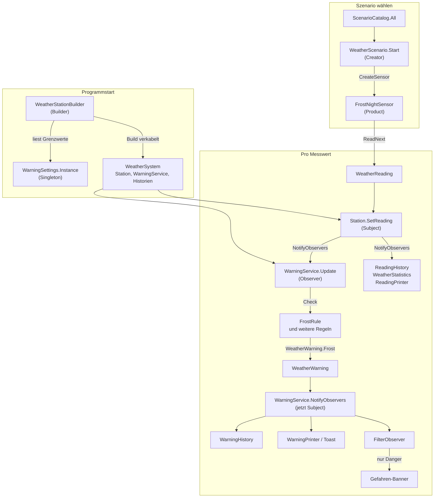

# Code-Rundgang: Folge dem Messwert

> Zurück zur [Übersicht (README)](../README.md). Dieser Rundgang setzt voraus, dass du [Observer](patterns/Observer.md) gelesen hast. Die anderen Kapitel helfen dir bei einzelnen Stationen: [Builder](patterns/Builder.md), [Factory Method](patterns/FactoryMethod.md), [Singleton](patterns/Singleton.md).

Du hast die Patterns einzeln kennengelernt. Jetzt siehst du, wie sie **zusammenspielen**. Wir folgen dabei einem einzigen Messwert von seiner Entstehung bis zum Bildschirm. Bei jedem Schritt steht dort, in welcher **Datei** das passiert, welche **Zeilen** wichtig sind und welche **Pattern-Rolle** gerade gespielt wird.

**Tipp:** Öffne die Dateien parallel in deiner IDE. Die Ausschnitte unten sind gekürzt (`...`), die Kommentare im Quelltext erklären mehr.

**Unser Beispiel:** Du startest die Konsole und wählst "2) Frostnacht". Ein Messwert nach etwa 3 Stunden Simulation: **0,0 °C**. Das löst eine Frostwarnung aus. Die Web-App macht dasselbe, nur startet dort der `SimulationRunner` die Schleife (Hinweise stehen jeweils dabei).

## Inhalt

1. [Der Überblick](#der-überblick)
2. [Teil A: Stufe 2 in Ausführungsreihenfolge](#teil-a-stufe-2-in-ausführungsreihenfolge)
3. [Die Gesamtkarte](#die-gesamtkarte)
4. [Teil B: Kurzer Rundgang durch Stufe 1](#teil-b-kurzer-rundgang-durch-stufe-1)
5. [Fragen zum Weiterdenken](#fragen-zum-weiterdenken)

---

## Der Überblick

| Schritt | Was passiert | Datei | Pattern |
|---|---|---|---|
| 1 | Das System wird gebaut | `Building/WeatherStationBuilder.cs` | **Builder** |
| 2 | Die Grenzwerte werden gelesen | `Settings/WarningSettings.cs` | **Singleton** |
| 3 | Der Builder verkabelt die Teile | `Building/WeatherStationBuilder.cs` | **Observer** (Subscribe) |
| 4 | Szenario wählen, Sensor wird erzeugt | `Scenarios/WeatherScenario.cs` | **Factory Method** |
| 5 | Die Konsole meldet eigene Observer an | `ConsoleApp/WeatherConsole.cs` | **Observer** (Subscribe) |
| 6 | Der Sensor liefert einen Messwert | `Scenarios/Sensors/*.cs` | Product |
| 7 | Die Station nimmt den Messwert an | `Services/Station.cs` | **Observer** (Subject) |
| 8 | Das Subject benachrichtigt alle | `Observer/Subject.cs` | **Observer** (NotifyObservers) |
| 9 | Der Warn-Dienst prüft die Regeln | `Services/WarningService.cs` | **Observer** (Observer) |
| 10 | Die Frost-Regel schlägt an | `Rules/FrostRule.cs`, `Models/WeatherWarning.cs` | (statische Hilfsmethode) |
| 11 | Der Warn-Dienst gibt die Warnung weiter | `Services/WarningService.cs` | **Observer** (Observer UND Subject) |
| 12 | Historie, Filter und Anzeige reagieren | `Observers/WarningHistory.cs`, `Observer/FilterObserver.cs` | **Observer** |
| 13 | Aufräumen: Station stoppen | `Services/Station.cs` | **Observer** (StationStopped) |

Alle Pfade beziehen sich auf `src/WeatherStation.Core/`, außer wo `ConsoleApp/` oder `Web/` steht.

---

## Teil A: Stufe 2 in Ausführungsreihenfolge

**Was vorher geschah:** Beim Start zeigt die Konsole das Menü (`AskForScenario`). Dabei liest `PrintLimits` schon einmal das Singleton `WarningSettings.Instance`, um die Grenzwerte anzuzeigen. Du tippst `2`, und die Konsole ruft `RunSimulation(scenario)` auf. Ab hier beginnt unser Rundgang.

### Schritt 1: Das System wird gebaut (Builder)

**Datei:** `src/WeatherStation.ConsoleApp/WeatherConsole.cs`, Methode `RunSimulation`

```csharp
WeatherSystem system = new WeatherStationBuilder()
    .SetName("Wetterstation Berufsschule")
    .AddAllWarnings()
    .Build();
```

**Was passiert:** Der Builder merkt sich zuerst nur die Wünsche (Name, alle fünf Regeln). Erst `Build()` erzeugt wirklich Objekte und verkabelt sie. Danach hast du ein `WeatherSystem` mit Station, Warn-Dienst und drei Helfern (`WarningHistory`, `ReadingHistory`, `WeatherStatistics`). Die Konsole baut bei **jedem** Simulationsstart ein frisches System.

**Rolle:** *Builder* (`WeatherStationBuilder`) und *Product* (`WeatherSystem`). In der Web-App steht derselbe Aufruf in `src/WeatherStation.Web/Program.cs`, dort in `AddSingleton(...)`. Dort wird nur **ein** System für die ganze Laufzeit der App gebaut.

Mehr dazu: [Builder](patterns/Builder.md).

### Schritt 2: Die Grenzwerte werden gelesen (Singleton)

**Datei:** `src/WeatherStation.Core/Building/WeatherStationBuilder.cs`, Methode `CreateRules`

```csharp
WarningSettings settings = WarningSettings.Instance;
var rules = new List<IWarningRule>();
// ...
if (_addFrost)
{
    rules.Add(new FrostRule(settings.FrostLimit, settings.FrostClearLimit));
}
```

**Was passiert:** Mitten in `Build()` holt sich der Builder die Grenzwerte. `WarningSettings.Instance` erzeugt beim **ersten** Zugriff die einzige Instanz (`Lazy<T>`), danach gibt es immer dasselbe Objekt zurück. In der Konsole gab es diesen ersten Zugriff schon im Menü (`PrintLimits`), der Builder bekommt also **dasselbe** Objekt. Der Builder gibt die Werte (`0.0` und `1.0`) **per Konstruktor** an die `FrostRule`. Die Regel selbst kennt das Singleton nicht.

**Rolle:** *Singleton* (`WarningSettings`). Im Kern ist der Builder der einzige Benutzer, die Oberflächen lesen die Werte nur zum Anzeigen. Die Datei dazu: `src/WeatherStation.Core/Settings/WarningSettings.cs`.

Mehr dazu: [Singleton](patterns/Singleton.md).

### Schritt 3: Die Verkabelung (Builder und Observer)

**Datei:** `src/WeatherStation.Core/Building/WeatherStationBuilder.cs`, Methode `Build`

```csharp
var station = new Station(_name);
var warningService = new WarningService(rules);
var warningHistory = new WarningHistory();
var readingHistory = new ReadingHistory(_readingCount);
var statistics = new WeatherStatistics();

// Verkabelung: Wer hört wem zu?
station.Subscribe(warningService);
station.Subscribe(readingHistory);
station.Subscribe(statistics);
warningService.Subscribe(warningHistory);
```

**Was passiert:** Die Station hat jetzt drei Zuhörer: `WarningService`, `ReadingHistory`, `WeatherStatistics`. Der `WarningService` hat einen Zuhörer: `WarningHistory`. Das ist der Ausgangszustand, bevor überhaupt ein Messwert existiert.

**Rolle:** Hier wird das Observer-Muster **aufgebaut**: `Subscribe` ist das Anmelden. Der Builder ist nur der Handwerker, der alles anschließt.

### Schritt 4: Szenario wählen, Sensor entsteht (Factory Method)

**Datei:** `src/WeatherStation.ConsoleApp/WeatherConsole.cs`, Methoden `AskForScenario` und `RunSimulation`

```csharp
// AskForScenario (lief schon VOR Schritt 1, siehe "Was vorher geschah"):
IReadOnlyList<WeatherScenario> scenarios = ScenarioCatalog.All;
for (int i = 0; i < scenarios.Count; i++)
{
    Console.Write($"   {i + 1}) {scenarios[i].Name}");
    // ...
}
// ... Nutzer tippt "2" ...

// RunSimulation (jetzt, direkt nach dem Builder):
DateTime startTime = DateTime.Today.AddHours(6);
ISensor sensor = scenario.Start(startTime);
```

**Was passiert:** Das Menü wurde **aus dem Katalog** gebaut (`ScenarioCatalog.All`). Die Konsole kennt keine Szenario-Klasse beim Namen. Du tippst `2`, und `scenario` ist ein `FrostNightScenario`-Objekt, obwohl die Variable nur als `WeatherScenario` deklariert ist. `scenario.Start(startTime)` läuft in der **Basisklasse** und ruft `CreateSensor` auf:

**Datei:** `src/WeatherStation.Core/Scenarios/WeatherScenario.cs` und `FrostNightScenario.cs`

```csharp
// WeatherScenario (Basisklasse): der gleiche Ablauf für alle
public ISensor Start(DateTime startTime)
{
    ISensor? sensor = CreateSensor(startTime);   // <-- Factory Method
    if (sensor == null) { throw new InvalidOperationException(...); }
    return sensor;
}

// FrostNightScenario (Unterklasse): entscheidet, WAS erzeugt wird
protected override ISensor CreateSensor(DateTime startTime)
{
    return new FrostNightSensor(startTime);
}
```

**Rolle:** *Creator* (`WeatherScenario`), *ConcreteCreator* (`FrostNightScenario`), *Product* (`ISensor`), *ConcreteProduct* (`FrostNightSensor`, `internal`). Zurück in der Konsole weiß niemand mehr, dass es ein `FrostNightSensor` ist. Man hat nur ein `ISensor`.

In der Web-App passiert das in `src/WeatherStation.Web/Services/SimulationRunner.cs` (Konstruktor und `ChangeScenario`).

Mehr dazu: [Factory Method](patterns/FactoryMethod.md).

### Schritt 5: Die Observer melden sich an (Observer)

**Datei:** `src/WeatherStation.ConsoleApp/WeatherConsole.cs`, Methode `RunSimulation`

```csharp
var readingPrinter = new ReadingPrinter();
system.Station.Subscribe(readingPrinter);

var warningPrinter = new WarningPrinter();
system.Warnings.Subscribe(warningPrinter);

var dangerBanner = new FilterObserver<WeatherWarning>(
    new ActionObserver<WeatherWarning>("Gefahren-Banner", PrintDangerBanner),
    warning => warning.Level == WarningLevel.Danger);
system.Warnings.Subscribe(dangerBanner);
```

**Was passiert:** Zusätzlich zu den drei Zuhörern aus Schritt 3 hängt die Konsole ihre **eigenen** an: Den `ReadingPrinter` (eine Zeile pro Messwert) an die Station, den `WarningPrinter` und das Gefahren-Banner an den Warn-Dienst. Die Station und der Warn-Dienst wurden dafür **nicht verändert**.

**Rolle:** *Observer* (Interface `IWeatherObserver<T>`), konkret `ReadingPrinter`, `WarningPrinter`, `ActionObserver<T>`. Der `FilterObserver<T>` ist eine Hülle: Er bekommt alle Warnungen, reicht aber nur `Danger` weiter. In der Web-App melden sich stattdessen die Seiten an, z. B. `Warnings.razor` und `WarningToaster.razor`.

### Schritt 6: Der Sensor liefert einen Messwert

**Datei:** `src/WeatherStation.Core/Scenarios/Sensors/CycleSensor.cs` und `FrostNightSensor.cs`

```csharp
// FrostNightSensor: Temperaturkurve (Schritt, Wert), ein Schritt = 10 Minuten
private static readonly (int Step, double Value)[] TemperatureCurve =
    [(0, 6), (30, -4), (40, -4), (56, 8), (72, 6)];

// CycleSensor: jeder Aufruf = 10 simulierte Minuten später
public WeatherReading ReadNext() { ... }
```

**Was passiert:** In der Konsolenschleife steht:

```csharp
WeatherReading reading = sensor.ReadNext();
system.Station.SetReading(reading); // verteilt an alle angemeldeten Observer
```

Die Temperatur fällt von 6 °C in 30 Schritten auf -4 °C. Nach etwa 18 Schritten (3 Stunden) liegt sie bei etwa **0,0 °C**. Der Sensor packt alles in ein `WeatherReading` (Zeit, Temperatur, Feuchte, Druck, Wind).

**Rolle:** *ConcreteProduct* der Factory Method. In der Web-App ruft der `SimulationRunner` (ein Hintergrunddienst) das alle 1,5 Sekunden auf: `_system.Station.SetReading(_sensor.ReadNext());`.

### Schritt 7: Die Station nimmt den Messwert an (Observer: Subject)

**Datei:** `src/WeatherStation.Core/Services/Station.cs`

```csharp
public void SetReading(WeatherReading reading)
{
    ArgumentNullException.ThrowIfNull(reading);

    if (IsStopped)
    {
        throw new InvalidOperationException("Die Station wurde gestoppt und nimmt keine Messwerte mehr an.");
    }

    Validate(reading);   // Temperatur -60..60, Feuchte 0..100, Druck 850..1100, Wind 0..300

    lock (_stateLock)
    {
        _lastReading = reading;
        _readingCount++;
    }

    NotifyObservers(reading);
}
```

**Was passiert:** Die Station prüft, ob der Messwert **plausibel** ist (sonst `ArgumentOutOfRangeException`, und niemand sieht ihn). Dann merkt sie sich ihn und ruft `NotifyObservers(reading)`. Das ist alles, was die Station selbst tut. Wer zuhört, weiß sie nicht.

**Rolle:** *ConcreteSubject* (`Station : Subject<WeatherReading>`). `SetReading` ist die Methode, die den Zustand ändert und damit die Meldung auslöst.

### Schritt 8: Das Subject benachrichtigt alle

**Datei:** `src/WeatherStation.Core/Observer/Subject.cs`, Methode `NotifyObservers` (hier ohne die Sperren)

```csharp
protected void NotifyObservers(T value)
{
    // ... merkt sich den Wert als "letzten Wert" und macht eine Momentaufnahme (Kopie) der Observer-Liste ...

    foreach (IWeatherObserver<T> observer in snapshot)
    {
        // ... (gekürzt: bricht ab, falls die Station inzwischen gestoppt wurde) ...
        DeliverUpdate(observer, value);
    }
}

private void DeliverUpdate(IWeatherObserver<T> observer, T value)
{
    try
    {
        observer.Update(value);
    }
    catch (Exception exception)
    {
        ObserverFailed?.Invoke(new ObserverError(observer.Name, exception));
    }
}
```

**Was passiert:** Die Basisklasse geht die Kopie der Liste durch und ruft bei **jedem** Observer `Update(value)` auf. Dabei gilt:

- Die **Kopie** erlaubt, dass sich ein Observer währenddessen an- oder abmeldet.
- Das **`try/catch`** pro Observer sorgt dafür, dass ein kaputter Observer die anderen nicht lahmlegt (Fehlerisolation). Den Fehler meldet das Event `ObserverFailed`.
- Der Wert wird als "letzter Wert" gemerkt, damit neue Observer ihn sofort bekommen (Replay).

**Rolle:** *Subject* (`Subject<T>`), die wiederverwendbare Basisklasse. Die Station erbt sie und muss die Liste nicht selbst führen.

Die ausführlichen Locks darin sind als "FÜR FORTGESCHRITTENE" markiert. Beim ersten Lesen darfst du sie überspringen.

Jetzt bekommen vier Observer **nacheinander** (in der Reihenfolge ihrer Anmeldung) denselben Messwert: die drei aus Schritt 3 (`WarningService`, `ReadingHistory`, `WeatherStatistics`) und der `ReadingPrinter` aus Schritt 5 (falls du ihn nicht mit `U` abgemeldet hast). Wir folgen dem `WarningService`.

### Schritt 9: Der Warn-Dienst prüft die Regeln (Observer: Observer)

**Datei:** `src/WeatherStation.Core/Services/WarningService.cs`, Methode `Update`

```csharp
public void Update(WeatherReading reading)
{
    var warnings = new List<WeatherWarning>();
    lock (_ruleLock)
    {
        foreach (IWarningRule rule in _rules)
        {
            warnings.AddRange(rule.Check(reading));
        }
    }

    foreach (WeatherWarning warning in warnings)
    {
        NotifyObservers(warning);
    }
}
```

**Was passiert:** Der Warn-Dienst ist hier **Zuhörer** der Station: Seine Methode `Update(reading)` wurde gerade von `NotifyObservers` der Station aufgerufen. Er fragt jede Regel (`IWarningRule.Check`), ob der Messwert etwas auslöst. Jede Regel liefert eine (oft leere) Liste von Warnungen zurück. Das `lock` schützt den Zustand der Regeln, er gehört zu den Fortgeschrittenen-Themen.

**Rolle:** *Observer* (`WarningService : IWeatherObserver<WeatherReading>`).

### Schritt 10: Die Frost-Regel schlägt an

**Dateien:** `src/WeatherStation.Core/Rules/FrostRule.cs` und `src/WeatherStation.Core/Models/WeatherWarning.cs`

```csharp
// FrostRule.Check
if (!_isActive && reading.Temperature <= _limit)
{
    _isActive = true;
    return [WeatherWarning.Frost(reading)];
}

// WeatherWarning
public static WeatherWarning Frost(WeatherReading reading)
{
    return new WeatherWarning(reading.Time, WarningType.Frost, WarningLevel.Warning,
        "Frostwarnung",
        $"Es hat {Format(reading.Temperature)} °C. Glättegefahr!");
}
```

**Was passiert:** Es sind 0,0 °C, die Grenze ist 0,0, und die Regel war noch nicht aktiv. Sie merkt sich `_isActive = true` (**Hysterese**: Die Entwarnung kommt erst bei 1,0 °C) und liefert **eine** Warnung. Die Warnung wird nicht mit `new` zusammengebaut, sondern mit der statischen Hilfsmethode `WeatherWarning.Frost(reading)`, die Titel, Text und Stufe festlegt. Bei den nächsten Messwerten (es wird noch kälter, bis -4 °C) passiert **nichts** mehr, denn die Regel ist schon aktiv. Erst wenn es morgens wieder 1,0 °C oder mehr hat, kommt **eine** Entwarnung.

**Rolle:** `FrostRule` ist **kein** Observer. Sie wird vom Warn-Dienst nur aufgerufen und kennt weder Station noch Zuhörer. `WeatherWarning.Frost(...)` ist eine **statische Fabrikmethode**, aber **nicht** das GoF-Muster Factory Method (siehe [Factory Method](patterns/FactoryMethod.md)).

### Schritt 11: Der Warn-Dienst gibt die Warnung weiter (Observer UND Subject)

**Datei:** `src/WeatherStation.Core/Services/WarningService.cs` (der `foreach` am Ende von `Update`)

```csharp
foreach (WeatherWarning warning in warnings)
{
    NotifyObservers(warning);
}
```

**Was passiert:** Dieselbe Methode `NotifyObservers`, die auch die Station benutzt hat, jetzt aber für `WeatherWarning`. Denn der Warn-Dienst erbt von `Subject<WeatherWarning>`. Er hat **eigene** Zuhörer und verteilt die Warnung an sie.

**Rolle:** `WarningService` spielt **beide Seiten**: Observer von `WeatherReading` (Schritt 9), Subject von `WeatherWarning` (jetzt). Deshalb entsteht eine **Kette**: Station, WarningService, Anzeige.

### Schritt 12: Historie, Filter und Anzeige reagieren

Der Warn-Dienst hat in der Konsole drei Zuhörer (einen aus Schritt 3, zwei aus Schritt 5). Jeder bekommt die Frostwarnung:

| Zuhörer | Was passiert | Datei |
|---|---|---|
| `WarningHistory` | Fügt die Warnung **vorne** in die Liste ein (neueste zuerst, höchstens 500). | `Observers/WarningHistory.cs` |
| `WarningPrinter` (Konsole) | Schreibt eine gelbe Zeile: `>> WARNUNG: Frostwarnung – Es hat 0,0 °C. Glättegefahr!` | `ConsoleApp/Observers/WarningPrinter.cs` |
| `FilterObserver` mit Banner | Prüft `Level == Danger`. Frost ist `Warning`, also wird **nichts** weitergereicht. | `Observer/FilterObserver.cs` |

**Datei:** `src/WeatherStation.Core/Observers/WarningHistory.cs`

```csharp
public void Update(WeatherWarning warning)
{
    lock (_lock)
    {
        // Neueste zuerst: vorne einfügen.
        _warnings.Insert(0, warning);
        if (_warnings.Count > MaxCount)
        {
            _warnings.RemoveAt(_warnings.Count - 1);
        }
    }
}
```

**Datei:** `src/WeatherStation.Core/Observer/FilterObserver.cs`

```csharp
public void Update(T value)
{
    if (_filter(value))
    {
        _target.Update(value);
    }
}
```

In der **Web-App** reagieren stattdessen: `WarningToaster.razor` (Toast ab Stufe "Warnung", ebenfalls ein `FilterObserver`), `Warnings.razor` (Tabelle liest die `WarningHistory` neu), `Home.razor` (Übersicht). Diese Seiten werden **nicht** auf dem UI-Thread benachrichtigt, sondern auf dem Thread des `SimulationRunner`. Darum holen sie sich mit `InvokeAsync` in den UI-Kontext zurück.

**Rolle:** Alles *konkrete Observer*. Beachte: `FilterObserver` ist selbst ein Observer, der einen anderen Observer einpackt. Der Warn-Dienst merkt davon nichts.

### Schritt 13: Aufräumen, die Station stoppt

**Datei:** `src/WeatherStation.ConsoleApp/WeatherConsole.cs` und `src/WeatherStation.Core/Services/Station.cs`

```csharp
// WeatherConsole.RunSimulation, im finally-Block
system.Station.Stop();

// Station
public void Stop()
{
    NotifyStopped();
}
```

**Was passiert:** Du drückst `Q`. `Stop()` ruft `NotifyStopped()` des Subjects: Das Subject leert seine Liste und ruft bei **allen** bisher angemeldeten Observern `StationStopped()` auf (der `ReadingPrinter` schreibt "[Messwert-Anzeige] Station beendet (StationStopped)."). Der `WarningService` gibt das weiter (`StationStopped() => NotifyStopped()`), damit auch **seine** Zuhörer es erfahren (der `WarningPrinter` schreibt "[Warn-Anzeige] Warn-Dienst beendet"). Danach kommen keine Meldungen mehr, ein weiteres `SetReading` würde eine Exception werfen.

Mit der Taste `U` in der Konsole kannst du zwischendurch einen einzelnen Observer abmelden (`Unsubscribe`) und wieder anmelden (`Subscribe`). Beim erneuten Anmelden bekommt er dank "Replay" sofort den letzten Messwert (`ToggleReadingPrinter`).

**Rolle:** *Observer*: `StationStopped` (in .NET: `OnCompleted`) und `Unsubscribe`.

---

## Die Gesamtkarte



So liest du die Karte: Der obere Block läuft **einmal** zu Beginn (in der Konsole bei jedem Simulationsstart, in der Web-App einmal beim Start der App). Der mittlere Block läuft, wenn ein Szenario gestartet wird. Der untere Block läuft **bei jedem Messwert** (alle 700 ms in der Konsole, alle 1,5 s in der Web-App).

---

## Teil B: Kurzer Rundgang durch Stufe 1

Stufe 1 (`src/WeatherStation.Beginner`) macht dasselbe, nur ohne Builder, Szenarien, Threads und Warn-Dienst. Die Datei `Program.cs` erzählt die ganze Geschichte. Lies sie von oben nach unten:

| Schritt | Zeile in `Program.cs` | Was passiert | Rolle |
|---|---|---|---|
| 1 | `var station = new Station();` | Das Subject entsteht, die Liste `_observers` ist leer. | Subject |
| 2 | `var display = new ScreenDisplay();` und drei weitere | Vier Observer-Objekte entstehen. Sie kennen die Station noch nicht. | Konkrete Observer |
| 3 | `station.Subscribe(display);` (viermal) | Jeder Observer wird in die Liste der Station eingetragen. `station.ObserverCount` ist 4. | Anmelden |
| 4 | `station.SetReading(readings[i]);` | Die Station bekommt einen Messwert. | Zustand ändert sich |
| 5 | in `Station.SetReading` | `Current = reading;` und dann `NotifyObservers(reading)`. | Benachrichtigen |
| 6 | in `Station.NotifyObservers` | `foreach (... in _observers.ToList()) observer.Update(reading);` | Update an alle |
| 7 | in `FrostWarner.Update` | `if (reading.Temperature <= 0)` gibt eine gelbe Warnung aus, sonst passiert nichts. | Observer reagiert |
| 8 | `station.Unsubscribe(display);` | Nach dem vierten Messwert meldet sich die Anzeige ab. Danach schweigt `[Anzeige]`. | Abmelden |
| 9 | Ende von `Program.cs` | `highest.Highest` und `frostWarner.WarningCount` zeigen, was die stillen Observer mitgezählt haben. | |

Die Dateien dazu: `Station.cs` (Subject), `IWeatherObserver.cs` (Vertrag), `Observers/*.cs` (die vier Zuhörer), `WeatherReading.cs` (der Messwert). Alles zusammen sind rund 150 bis 200 Zeilen.

**So hängt Stufe 1 mit Stufe 2 zusammen:**

| Stufe 1 | Stufe 2 |
|---|---|
| `Station` | `Subject<T>` + `Station` |
| `IWeatherObserver` | `IWeatherObserver<T>` |
| `ScreenDisplay`, `FrostWarner` | `ReadingPrinter`, `WarningPrinter`, `FrostRule` im `WarningService` |
| `Subscribe`, `Unsubscribe`, `SetReading`, `Update` | dieselben Namen |

Der wichtigste Unterschied: In Stufe 1 prüft **jeder Observer selbst** (`if (reading.Temperature <= 0)` im `FrostWarner`). In Stufe 2 prüfen **Regeln** im `WarningService`, und die Observer bekommen schon fertige `WeatherWarning`-Objekte.

---

## Fragen zum Weiterdenken

1. Du schreibst einen `SmsWarner`. Welche **Datei** brauchst du neu, und in welcher **bestehenden** Datei änderst du etwas? (Tipp: Schau dir Schritt 5 an.)
2. Warum ruft die `FrostRule` nicht selbst `NotifyObservers`? Was würde sich an ihrer Testbarkeit ändern?
3. Du ergänzt ein Szenario "Gewitter". Nenne die Dateien, die du **anlegst**, und die **eine** Datei, in der du einen Eintrag ergänzen musst.
4. Der `WarningService` wirft bei einer Regel eine Exception. Was passiert mit den anderen Regeln, was mit den Observern der Station? (Tipp: Schau dir `DeliverUpdate` in Schritt 8 an.)
5. Warum ist `WarningSettings.Instance` an **einer** Stelle im Builder gelesen und nicht in `FrostRule`? Wo sieht man das im Ablauf?
6. Auf welchem Thread laufen die Schritte 7 bis 12 in der Web-App, und was folgt daraus für eine Blazor-Seite, die sich anmeldet?
