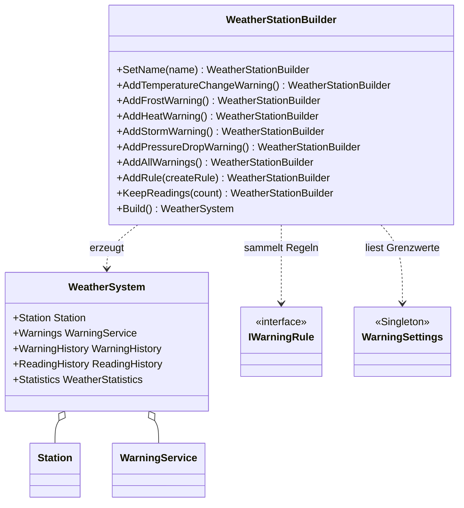

# Builder (Erbauer)

> Zurück zur [Übersicht (README)](../../README.md) · Siehe auch [Observer](Observer.md) · [Code-Rundgang](../CODE-RUNDGANG.md)

## In einem Satz

Ein **Builder** sammelt Schritt für Schritt die Wünsche und baut erst am Ende (`Build()`) das komplette, geprüfte Objekt zusammen.

### Der Alltagsvergleich: Burger bestellen oder Auto-Konfigurator

Du bestellst einen Burger: Brötchen, Patty, Käse, ohne Zwiebeln, extra Soße. Niemand ruft in die Küche: "Burger(true, false, true, false, true, 2, ...)". Du sagst die Wünsche **nacheinander**, und am Ende bekommst du **ein fertiges Ergebnis**.

Genauso beim Auto-Konfigurator im Internet: Farbe wählen, Felgen wählen, Anhängerkupplung ja oder nein. Erst beim Klick auf "Bestellen" entsteht das Auto. Und der Konfigurator meldet dir, wenn etwas fehlt ("Bitte Motor wählen").

| Alltag | In diesem Projekt |
|---|---|
| Du als Kunde | Der Code in `Program.cs` |
| Die Bestellung Schritt für Schritt | `SetName`, `AddFrostWarning`, `KeepReadings`, ... |
| "Bestellen"-Knopf | `Build()` |
| Das fertige Essen | `WeatherSystem` |
| "Bitte Motor wählen" | `InvalidOperationException` mit hilfreicher Meldung |

---

## Das Problem – so sähe der Code OHNE Pattern aus

Eine Wetterstation besteht aus vielen Teilen, die **richtig verkabelt** werden müssen: `Station`, `WarningService`, mehrere Regeln, `WarningHistory`, `ReadingHistory`, `WeatherStatistics`. Ohne Builder könntest du einen riesigen Konstruktor schreiben und die Verkabelung von Hand erledigen:

```csharp
// AUSGEDACHTES Gegenbeispiel – diesen Konstruktor gibt es im Projekt NICHT.
// So NICHT: ein langer Konstruktor mit lauter true/false und Zahlen.
var system = new WeatherSystem(
    "Wetterstation Berufsschule",
    true,    // Temperaturänderung?
    true,    // Frost?
    true,    // Hitze?
    true,    // Sturm?
    false,   // Luftdruck?
    144,     // Wie viele Messwerte?
    3.0, 0.0, 1.0, 30.0, 28.0);   // Grenzwerte ... welcher war welcher?
```

Oder die Teile einzeln zusammenstecken, in **jedem** Programm, das eine Station braucht. Dieser Code würde mit den echten Klassen des Projekts tatsächlich kompilieren, und genau das ist das Tückische:

```csharp
// So NICHT: Verkabelung von Hand, in jedem Programm neu.
var station = new Station("Wetterstation Berufsschule");
var rules = new List<IWarningRule>
{
    new TemperatureChangeRule(3.0),
    new FrostRule(0.0, 1.0),
    new HeatRule(30.0, 28.0),
    new StormRule(75.0, 60.0),
    new PressureDropRule(3.0, TimeSpan.FromHours(3))
};
var warningService = new WarningService(rules);
var warningHistory = new WarningHistory();
var readingHistory = new ReadingHistory(144);
var statistics = new WeatherStatistics();

station.Subscribe(warningService);
station.Subscribe(readingHistory);
// station.Subscribe(statistics);   <- vergessen! Die Statistik bleibt leer, und niemand merkt es.
warningService.Subscribe(warningHistory);
```

Die konkreten Probleme:

- **Unlesbar.** Was bedeutet das dritte `true`? Welche Zahl ist der Frost-Grenzwert, welche die Entwarnung? Beim Lesen musst du raten.
- **Verkabelung wird vergessen.** Ein fehlendes `Subscribe` ist kein Compilerfehler. Das Programm läuft, nur fehlt etwas. Solche Fehler findet man spät.
- **Doppelter Code.** Konsole, Web-App und Tests brauchen alle eine Station. Jeder kopiert die 15 Zeilen, und beim ersten Änderungswunsch passt man nur eine Kopie an.
- **Keine Prüfung.** Niemand sagt dir, dass du keine Regel angegeben hast. Die Station läuft und warnt nie.
- **Was passiert, wenn morgen ein SMS-Warner (oder eine neue Regel) dazukommt?** Du musst in jedem Programm die Verkabelung erweitern.
- **Unpraktisch bei vielen optionalen Teilen.** Bei 5 optionalen Regeln bräuchtest du entweder einen Konstruktor mit allen Schaltern (siehe oben) oder viele Konstruktoren für verschiedene Kombinationen (die sogenannte *Konstruktor-Explosion*).

---

## Die Lösung – MIT Pattern

Der **Builder** nimmt die Wünsche entgegen. Jede `Add...`-Methode merkt sich nur den Wunsch und gibt den Builder selbst zurück (`return this`). So kannst du die Aufrufe hintereinander schreiben. Das nennt man **Fluent Interface**.

Benutzung (`src/WeatherStation.Web/Program.cs`):

```csharp
builder.Services.AddSingleton(_ => new WeatherStationBuilder()
    .SetName("Wetterstation Berufsschule")
    .AddAllWarnings()          // Frost, Hitze, Sturm, Luftdruck, Temperatursprung
    .KeepReadings(144)         // 144 Messwerte x 10 Minuten = 24 Stunden im Diagramm
    .Build());
```

Die Konsole (`src/WeatherStation.ConsoleApp/WeatherConsole.cs`) braucht dasselbe, nur ohne `KeepReadings` (dann gilt der Standardwert 144):

```csharp
WeatherSystem system = new WeatherStationBuilder()
    .SetName("Wetterstation Berufsschule")
    .AddAllWarnings()
    .Build();
```

Man liest es wie eine Bestellung. Die Verkabelung steckt **einmal** in `Build()`.

---

## Schritt für Schritt: Was passiert beim Ausführen?

Wir folgen dem Aufruf aus der Konsole.

1. **`new WeatherStationBuilder()`** erzeugt einen leeren Builder. Er hat Felder wie `_name = null`, `_addFrost = false`, `_readingCount = 144` (Standard).
2. **`.SetName("Wetterstation Berufsschule")`** speichert den Namen im Feld `_name` und gibt `this` zurück.
3. **`.AddAllWarnings()`** ruft nacheinander `AddTemperatureChangeWarning()`, `AddFrostWarning()`, `AddHeatWarning()`, `AddStormWarning()`, `AddPressureDropWarning()` auf. Jede setzt nur ein Flag (`_addFrost = true` usw.). Es wird noch **nichts gebaut**.
4. **`.Build()`** startet jetzt die eigentliche Arbeit:
   1. Ist ein Name gesetzt? Wenn nicht: `InvalidOperationException("... SetName ...")`.
   2. `CreateRules()` liest **einmal** das Singleton `WarningSettings.Instance` und erzeugt für jedes Flag die passende Regel mit den Grenzwerten (`new FrostRule(settings.FrostLimit, settings.FrostClearLimit)`).
   3. Gibt es mindestens eine Regel? Wenn nicht: `InvalidOperationException`.
   4. Neue Objekte erzeugen: `Station`, `WarningService`, `WarningHistory`, `ReadingHistory`, `WeatherStatistics`.
   5. **Verkabeln:** Wer hört wem zu?
   6. Alles in ein `WeatherSystem` packen und zurückgeben.
5. **Du hast ein fertiges `WeatherSystem`** mit `system.Station`, `system.Warnings` usw. und musst dich um nichts mehr kümmern.

Die Verkabelung in `Build()` (`src/WeatherStation.Core/Building/WeatherStationBuilder.cs`):

```csharp
var station = new Station(_name);
var warningService = new WarningService(rules);
var warningHistory = new WarningHistory();
var readingHistory = new ReadingHistory(_readingCount);
var statistics = new WeatherStatistics();

// Verkabelung: Wer hört wem zu?
station.Subscribe(warningService);
station.Subscribe(readingHistory);
station.Subscribe(statistics);
warningService.Subscribe(warningHistory);

return new WeatherSystem(station, warningService, warningHistory, readingHistory, statistics);
```

Das ist die Observer-Kette aus dem [Observer-Kapitel](Observer.md), einmal sauber an **einer** Stelle zusammengesteckt.

---

## Die Rollen und wie die Klassen zusammenhängen

| Rolle | Bedeutung | Klasse in diesem Projekt |
|---|---|---|
| **Builder** | Sammelt die Wünsche, baut am Ende zusammen | `WeatherStationBuilder` |
| **Bauschritte** | Methoden, die jeweils einen Wunsch notieren | `SetName`, `AddTemperatureChangeWarning`, `AddFrostWarning`, `AddHeatWarning`, `AddStormWarning`, `AddPressureDropWarning`, `AddAllWarnings`, `AddRule`, `KeepReadings` |
| **Product (Produkt)** | Das fertige Objekt | `WeatherSystem` |
| **Client (Aufrufer)** | Code, der die Bauschritte aufruft und `Build()` auslöst | `Program.cs` (Web), `WeatherConsole.RunSimulation` (Konsole) |

### Ehrlich gesagt: Das ist der "Fluent Builder", nicht die GoF-Originalform

Im GoF-Buch ("Gang of Four", das Standardbuch zu Design Patterns) sieht der Builder etwas anders aus:

- Es gibt ein **Builder-Interface** und **mehrere konkrete Builder**, die aus denselben Bauschritten **verschiedene Produkte** bauen (Beispiel aus dem Buch: Derselbe Text wird einmal als RTF-, einmal als ASCII-Dokument gebaut).
- Ein **Director** ist eine eigene Klasse, die die Bauschritte in einer festen Reihenfolge aufruft. Er kennt nur das Builder-Interface.

In diesem Projekt (und in den meisten C#-Projekten heute) benutzen wir die einfachere, verbreitete Variante, den **Fluent Builder**: **eine** Builder-Klasse, Methoden mit `return this`, ein `Build()` am Ende. Ein Builder-Interface und einen Director gibt es hier **nicht**. Am nächsten an einen Director kommt `AddAllWarnings()`: Es ruft eine feste Folge von Bauschritten auf. Die Grundidee ist in beiden Varianten dieselbe: **Den Bau eines komplexen Objekts von seiner Darstellung trennen und schrittweise ablaufen lassen.**



Der Builder arbeitet mit dem [Singleton](Singleton.md) zusammen: Im Kern (`WeatherStation.Core`) ist er der **einzige** Ort, an dem `WarningSettings.Instance` gelesen wird. Die Regeln bekommen die Grenzwerte von ihm per Konstruktor. (Die Oberflächen lesen das Singleton zusätzlich, aber nur, um die Grenzwerte anzuzeigen.)

So liest du das Diagramm: Gestrichelter Pfeil (`..>`) = "benutzt bzw. erzeugt", Linie mit Raute (`o--`) = "hat/enthält".

### Eigene Regeln: `AddRule`

Für eigene Regeln gibt es `AddRule(() => new MeineRegel())`. Du übergibst nicht die Regel selbst, sondern eine kleine **Funktion**, die eine neue Regel liefert. `Build()` ruft sie bei jedem Aufruf erneut auf. Grund: Regeln haben einen **Zustand** (`_isActive`, siehe Hysterese im [Observer-Kapitel](Observer.md)). Würden zwei Systeme dieselbe Regel-Instanz teilen, würden sie sich gegenseitig stören. Der Builder erkennt sogar den Fehler `AddRule(() => eineVorhandeneRegel)` (die Funktion liefert bei jedem `Build()` dieselbe Instanz) und wirft beim zweiten `Build()` eine Exception.

---

## Wo findest du es im Projekt?

| Was | Datei |
|---|---|
| Builder | `src/WeatherStation.Core/Building/WeatherStationBuilder.cs` |
| Produkt | `src/WeatherStation.Core/Building/WeatherSystem.cs` |
| Benutzung Web | `src/WeatherStation.Web/Program.cs` |
| Benutzung Konsole | `src/WeatherStation.ConsoleApp/WeatherConsole.cs` (`RunSimulation`) |
| Tests | `tests/WeatherStation.Tests/BuilderTests.cs` |

Zum Vergleich: In **Stufe 1** (`src/WeatherStation.Beginner/Program.cs`) gibt es keinen Builder. Dort sind es nur vier `Subscribe`-Aufrufe, das lohnt keinen Builder.

---

## Vorteile / Nachteile

| Vorteile | Nachteile |
|---|---|
| **Lesbar:** Der Sinn steht im Methodennamen (`AddFrostWarning()`), nicht in einer Parameterliste. | **Mehr Code:** Eine zusätzliche Klasse mit vielen Methoden. |
| **Verkabelung an einer Stelle:** Keiner kann sie mehr vergessen. | **Fehler erst zur Laufzeit:** Ein vergessenes `SetName` fällt erst bei `Build()` auf, nicht beim Kompilieren. |
| **Prüfung zentral:** `Build()` meldet fehlende Pflichtangaben. | **Bei einfachen Objekten übertrieben.** |
| **Gleiche Bauanleitung, verschiedene Ergebnisse:** Konsole und Web nutzen dieselbe Klasse mit anderen Wünschen. | Man muss wissen, dass `Build()` das Ergebnis liefert (nicht vergessen, aufzurufen). |
| **Jedes `Build()` liefert ein neues, unabhängiges System.** | |

---

## Typische Fehler

- **`Build()` vergessen.** `var x = new WeatherStationBuilder().SetName("A").AddAllWarnings();` ergibt einen **Builder**, kein System. Der Compiler meldet es spätestens, wenn du dann `x.Station` aufrufst (der Builder hat keine Eigenschaft `Station`).
- **Pflichtangaben nicht prüfen.** Ein Builder ohne Prüfung in `Build()` liefert halbfertige Objekte. Prüfe hier, nicht erst später irgendwo. Bei uns: Name und mindestens eine Regel.
- **Builder wiederverwenden.** Bei uns liefert jedes `Build()` ein neues, unabhängiges System. Das geht nur, weil Regeln als Funktion (`Func<IWarningRule>`) gespeichert werden. Würdest du eine einzelne Regel-Instanz teilen, teilten sich zwei Systeme den Zustand.
- **Nicht jedes Objekt braucht einen Builder.** Bei zwei Parametern ist ein Konstruktor besser. Der Builder lohnt sich bei **vielen optionalen Teilen** und **komplizierter Verkabelung**.
- **Doppelte Add-Aufrufe.** `AddFrostWarning()` zweimal aufzurufen setzt nur ein Flag und baut die Regel trotzdem nur einmal. Das ist Absicht und wird im Test geprüft.
- **Builder verwechseln mit Factory Method.** Der Builder baut **ein** Objekt aus **vielen Teilen** nach Wunsch. Die [Factory Method](FactoryMethod.md) entscheidet, **welche Art** Objekt entsteht.

---

## So heißt das in .NET / in der Praxis

Die Builder-Idee ist in .NET überall. Du hast sie schon benutzt (meist in der einfachen Fluent-Form, nicht in der GoF-Originalform mit Director):

| Beispiel | Was wird gebaut? |
|---|---|
| `StringBuilder` | Ein Text, Stück für Stück mit `Append(...)` (gibt `this` zurück, darum `sb.Append("a").Append("b")`); das fertige Ergebnis kommt mit `ToString()`. |
| `WebApplication.CreateBuilder(args)` | Liefert einen `WebApplicationBuilder`. Du registrierst Dienste (`builder.Services.Add...`) und rufst am Ende `builder.Build()` auf, das ergibt die fertige `WebApplication`. Genau so in `src/WeatherStation.Web/Program.cs`. |
| `Host.CreateDefaultBuilder()` / `HostBuilder` | Ein generischer Host (Dienste, Konfiguration, Logging). |
| `ConfigurationBuilder` | Eine Konfiguration aus mehreren Quellen (`AddJsonFile`, `AddEnvironmentVariables`, ... `Build()`). |
| `UriBuilder`, `SqlConnectionStringBuilder` | Eine Adresse bzw. ein Connection-String. Hier setzt du Eigenschaften (`builder.Host = ...`) statt Methoden zu verketten und liest das Ergebnis über `Uri` bzw. `ConnectionString`. |

Erkennungsmerkmal: Ein eigenes Objekt sammelt die Angaben Schritt für Schritt, und erst ein letzter Aufruf (`Build()`, `ToString()`, ...) liefert das fertige Ergebnis. Oft (aber nicht immer) geben die Methoden `this` zurück.

---

## Teste dich selbst

<details>
<summary>1. Warum geben die <code>Add...</code>-Methoden <code>this</code> zurück?</summary>

Damit man die Aufrufe hintereinander schreiben kann (Fluent Interface): `.SetName(...).AddAllWarnings().Build()`.
</details>

<details>
<summary>2. Was passiert, wenn du <code>Build()</code> aufrufst, ohne vorher <code>SetName</code> aufzurufen?</summary>

`Build()` wirft eine `InvalidOperationException` mit dem Hinweis, zuerst `SetName(...)` aufzurufen. Der Builder prüft die Pflichtangaben, bevor er das Objekt zusammenbaut.
</details>

<details>
<summary>3. Warum nimmt <code>AddRule</code> eine Funktion (<code>Func&lt;IWarningRule&gt;</code>) und keine fertige Regel?</summary>

Regeln haben einen Zustand (z. B. "Frostwarnung ist aktiv"). Jedes `Build()` soll ein unabhängiges System liefern. Mit einer Funktion bekommt jedes System seine **eigene** neue Regel. Mit einer fertigen Regel würden sich zwei Systeme heimlich eine Regel (und deren Zustand) teilen.
</details>

<details>
<summary>4. Wer verkabelt, wer hört wem zu? Wo steht das im Code?</summary>

In `WeatherStationBuilder.Build()`: Die Station wird von `WarningService`, `ReadingHistory` und `WeatherStatistics` beobachtet. Der `WarningService` wird von der `WarningHistory` beobachtet.
</details>

<details>
<summary>5. Wann würdest du <em>keinen</em> Builder benutzen?</summary>

Bei Objekten mit wenigen Pflichtparametern und ohne optionale Teile. Ein `new Station("Name")` braucht keinen Builder. Ein Builder lohnt sich bei vielen optionalen Teilen und aufwendiger Verkabelung.
</details>
