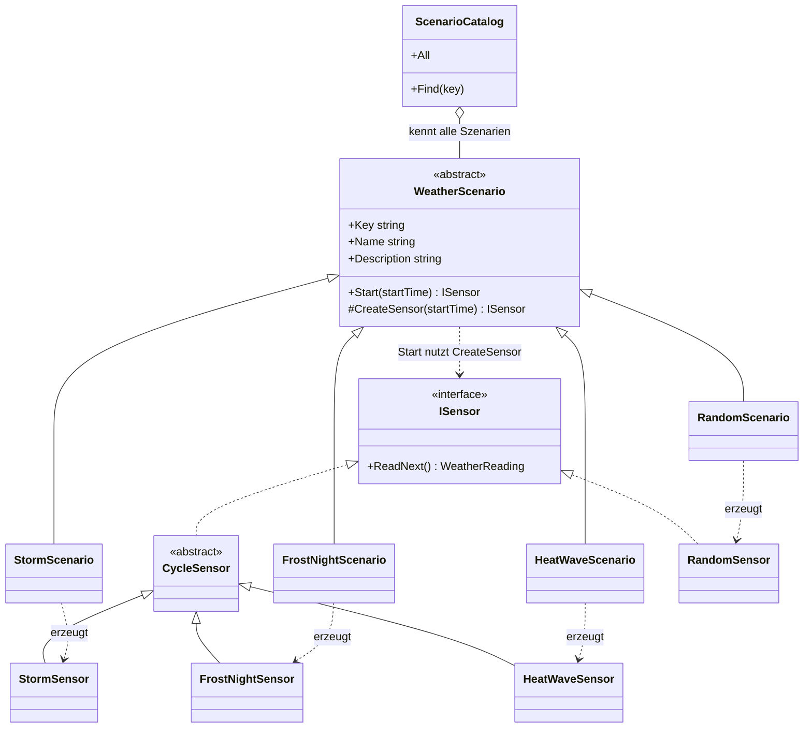

# Factory Method (Fabrikmethode)

> Zurück zur [Übersicht (README)](../../README.md) · Siehe auch [Builder](Builder.md) · [Code-Rundgang](../CODE-RUNDGANG.md)

## In einem Satz

Eine Basisklasse legt den **Ablauf** fest und ruft dabei eine **abstrakte Methode** auf. Die **Unterklasse** überschreibt diese Methode und entscheidet damit, **welches Objekt** entsteht.

### Der Alltagsvergleich: Pizzeria-Filialen

Eine Pizzeria-Kette hat für alle Filialen denselben Ablauf: Teig ausrollen, belegen, backen, schneiden, verpacken. Aber **was** belegt wird, entscheidet jede Filiale selbst. In Neapel kommt Mozzarella di Bufala drauf, in Chicago kommt eine dicke Schicht Käse drauf. Der Ablauf (die Basisklasse) ist überall gleich. Die Pizza (das Produkt) bestimmt die Filiale (die Unterklasse).

Ein zweites Bild, die **Bäckerei**: Du bestellst "Brötchen". Das Rezept ist je nach Bäckerei anders. Du musst es nicht kennen. Du bekommst Brötchen.

| Alltag | In diesem Projekt |
|---|---|
| Der gleiche Ablauf in jeder Filiale | `WeatherScenario.Start(...)` |
| Die Filiale entscheidet, was auf die Pizza kommt | Die Unterklasse überschreibt `CreateSensor(...)` |
| Die Pizza | `ISensor` (konkret z. B. `StormSensor`) |
| Du als Kunde isst nur "Pizza" | Der Aufrufer kennt nur `ISensor` |
| Die Filialen | `StormScenario`, `FrostNightScenario`, `HeatWaveScenario`, `RandomScenario` |

---

## Das Problem – so sähe der Code OHNE Pattern aus

Die Oberfläche (Konsole oder Web) soll abhängig vom gewählten Szenario den passenden Sensor erzeugen. Ohne Pattern schreibt man das naheliegend mit einem `switch`:

```csharp
// AUSGEDACHTES Gegenbeispiel – so steht es NICHT im Projekt.
// (Außerhalb des Core würde es nicht einmal kompilieren, weil die Sensor-Klassen internal sind.)
// So NICHT: Der Aufrufer kennt jede Sensor-Klasse.
ISensor CreateSensor(string scenarioKey, DateTime startTime)
{
    switch (scenarioKey)
    {
        case "storm":
            return new StormSensor(startTime);
        case "frost":
            return new FrostNightSensor(startTime);
        case "heat":
            return new HeatWaveSensor(startTime);
        case "random":
            return new RandomSensor(startTime, seed: null);
        default:
            throw new ArgumentException($"Unbekanntes Szenario: {scenarioKey}");
    }
}

// Und an einer zweiten Stelle noch einmal, für das Menü:
string GetScenarioName(string key) => key switch
{
    "storm"  => "Sturmfront zieht auf",
    "frost"  => "Frostnacht",
    "heat"   => "Hitzewelle",
    "random" => "Zufälliges Wetter",
    _        => throw new ArgumentException()
};
```

Das funktioniert, solange es **vier** Szenarien gibt. Aber:

**Was passiert, wenn morgen ein Szenario "Gewitter" dazukommt?**
Du musst **jede** Stelle finden, an der es einen `switch` über die Szenarien gibt (hier: mindestens zwei, in der Konsole, in der Web-App und in den Tests vielleicht mehr) und überall einen Zweig ergänzen. Vergisst du einen, gibt es einen Laufzeitfehler (`default` wirft).

Die konkreten Probleme:

- **Der Aufrufer kennt alle konkreten Sensor-Klassen.** Er ist eng an `StormSensor`, `FrostNightSensor` & Co. gekoppelt. Diese Klassen sind sogar `internal` (nur innerhalb des eigenen Projekts sichtbar): Konsole und Web-App dürfen sie gar nicht sehen.
- **Streuung:** Das Wissen "welches Szenario gehört zu welchem Sensor" steht an mehreren Stellen verteilt.
- **Fehleranfällig:** Ein neuer Fall wird leicht an einer Stelle vergessen. Der Compiler warnt dich nicht (bei `string`-Schlüsseln).
- **Daten und Verhalten sind getrennt:** Name, Beschreibung und Sensor eines Szenarios gehören zusammen, stehen aber in getrennten Listen.
- **Schwer erweiterbar:** Jede Änderung heißt: bestehenden, funktionierenden Code **ändern**. Besser wäre: neuen Code **hinzufügen**.

---

## Die Lösung – MIT Pattern

Jedes Szenario ist eine **Klasse**. Alle erben von einer gemeinsamen Basisklasse `WeatherScenario`. Die Basisklasse hat die Methode `Start(...)`, die für alle gleich ist. Darin ruft sie `CreateSensor(...)` auf, und diese Methode ist **abstrakt**: Jede Unterklasse **muss** sie überschreiben.

Die Basisklasse (`src/WeatherStation.Core/Scenarios/WeatherScenario.cs`):

```csharp
public abstract class WeatherScenario
{
    public abstract string Key { get; }
    public abstract string Name { get; }
    public abstract string Description { get; }

    // <-- Die Factory Method: Die Unterklasse entscheidet, welcher Sensor entsteht.
    protected abstract ISensor CreateSensor(DateTime startTime);

    public ISensor Start(DateTime startTime)
    {
        ISensor? sensor = CreateSensor(startTime);
        if (sensor == null)
        {
            throw new InvalidOperationException($"Das Szenario '{Key}' hat keinen Sensor erzeugt.");
        }
        return sensor;
    }
}
```

Eine Unterklasse (`src/WeatherStation.Core/Scenarios/StormScenario.cs`):

```csharp
public sealed class StormScenario : WeatherScenario
{
    public override string Key => "storm";
    public override string Name => "Sturmfront zieht auf";
    public override string Description =>
        "Der Luftdruck fällt, der Wind steigt auf etwa 90 km/h: ...";

    protected override ISensor CreateSensor(DateTime startTime)
    {
        return new StormSensor(startTime);
    }
}
```

Der Aufrufer (`src/WeatherStation.Web/Services/SimulationRunner.cs`) kennt nur `WeatherScenario` und `ISensor`:

```csharp
WeatherScenario newScenario = ScenarioCatalog.Find(key);
// ...
_sensor = newScenario.Start(startTime);
```

Und das neue Szenario "Gewitter"? Eine neue Klasse `ThunderstormScenario : WeatherScenario` plus ein Sensor, plus **ein** Eintrag im `ScenarioCatalog`. In der Konsole und im Web ändert sich **keine Zeile**. Das Menü wird aus `ScenarioCatalog.All` gebaut, das neue Szenario taucht von selbst auf.

---

## Schritt für Schritt: Was passiert beim Ausführen?

Der Nutzer wählt in der Konsole "1) Sturmfront zieht auf".

1. **Menü:** `WeatherConsole.AskForScenario()` geht durch `ScenarioCatalog.All` und schreibt für jedes Szenario `Name` und `Description` auf den Bildschirm. Die Konsole kennt keine Szenario-Klasse beim Namen, sie fragt nur das Verzeichnis.
2. **Auswahl:** Der Nutzer tippt `1`. `AskForScenario` gibt `scenarios[0]` zurück. Das ist ein `WeatherScenario`. Zur Laufzeit ist es in Wirklichkeit ein `StormScenario`-Objekt.
3. **Start:** `RunSimulation` ruft `scenario.Start(startTime)` auf. Das ist die Methode der **Basisklasse**.
4. **Factory Method:** `Start` ruft `CreateSensor(startTime)` auf. Weil die Methode abstrakt ist und `StormScenario` sie überschreibt, läuft **dessen** Version (dynamische Bindung, "Polymorphie").
5. **Erzeugen:** `StormScenario.CreateSensor` erzeugt `new StormSensor(startTime)` und gibt es als `ISensor` zurück.
6. **Prüfung:** `Start` prüft, dass nicht `null` zurückkam, und gibt den Sensor weiter.
7. **Benutzen:** Die Konsole ruft nur noch `sensor.ReadNext()` auf. Sie weiß nicht und muss nicht wissen, dass es ein `StormSensor` ist.

Wählt der Nutzer stattdessen "2) Frostnacht", ist Schritt 3 identisch, und ab Schritt 4 läuft `FrostNightScenario.CreateSensor`. Genau das ist der Punkt: **Der Ablauf bleibt gleich, nur das erzeugte Objekt unterscheidet sich.**

---

## Die Rollen und wie die Klassen zusammenhängen

| GoF-Rolle | Bedeutung | Klasse in diesem Projekt |
|---|---|---|
| **Product** | Die Schnittstelle des erzeugten Objekts | `ISensor` |
| **ConcreteProduct** | Die konkreten Produkte | `StormSensor`, `FrostNightSensor`, `HeatWaveSensor`, `RandomSensor` (alle `internal`; die ersten drei erben von der Hilfsklasse `CycleSensor`, `RandomSensor` implementiert `ISensor` direkt) |
| **Creator** | Basisklasse mit dem Ablauf; ruft die Factory Method auf | `WeatherScenario` (abstrakt, Methode `Start`) |
| **Factory Method** | Die überschreibbare Methode, die das Produkt erzeugt (meist `abstract`; laut GoF darf sie auch `virtual` mit einer Standard-Umsetzung sein) | `protected abstract ISensor CreateSensor(DateTime startTime)` |
| **ConcreteCreator** | Unterklassen, die die Factory Method überschreiben | `StormScenario`, `FrostNightScenario`, `HeatWaveScenario`, `RandomScenario` |



So liest du das Diagramm: Durchgezogener Pfeil mit Dreieck (`<|--`) = "erbt von", gestrichelter Pfeil mit Dreieck (`<|..`) = "implementiert das Interface", gestrichelter Pfeil (`..>`) = "erzeugt bzw. benutzt". Links oben steht der **Ablauf** (`WeatherScenario`), rechts das **Produkt** (`ISensor`). Jede Szenario-Unterklasse ist mit genau **einer** Sensor-Klasse verbunden. `CycleSensor` ist nur eine gemeinsame Hilfs-Basisklasse für die Sensoren mit festem Ablauf und spielt im Muster keine eigene Rolle.

Der `ScenarioCatalog` ist **nicht** Teil des GoF-Musters, er ist ein einfaches Verzeichnis. Er sorgt dafür, dass die Menüs der Oberflächen aus der Liste gebaut werden, statt jedes Szenario einzeln zu nennen.

---

## Wo findest du es im Projekt?

| Was | Datei |
|---|---|
| Creator + Factory Method | `src/WeatherStation.Core/Scenarios/WeatherScenario.cs` |
| ConcreteCreator | `StormScenario.cs`, `FrostNightScenario.cs`, `HeatWaveScenario.cs`, `RandomScenario.cs` (alle in `src/WeatherStation.Core/Scenarios/`) |
| Product | `src/WeatherStation.Core/Scenarios/ISensor.cs` |
| ConcreteProduct | `src/WeatherStation.Core/Scenarios/Sensors/` (`StormSensor.cs`, `FrostNightSensor.cs`, `HeatWaveSensor.cs`, `RandomSensor.cs`, gemeinsame Basis `CycleSensor.cs`) |
| Verzeichnis der Szenarien | `src/WeatherStation.Core/Scenarios/ScenarioCatalog.cs` |
| Benutzung Web | `src/WeatherStation.Web/Services/SimulationRunner.cs` (`ChangeScenario`) |
| Benutzung Konsole | `src/WeatherStation.ConsoleApp/WeatherConsole.cs` (`AskForScenario`, `RunSimulation`) |
| Tests | `tests/WeatherStation.Tests/ScenarioTests.cs` |

---

## Vorteile / Nachteile

| Vorteile | Nachteile |
|---|---|
| **Erweiterbar ohne Änderung:** Neues Szenario = neue Klassen + ein Katalogeintrag. Bestehender Code bleibt unberührt (*Open/Closed-Prinzip*). | **Mehr Klassen:** Für vier Fälle brauchst du vier Szenario- und vier Sensor-Klassen. |
| **Der Aufrufer kennt nur `ISensor`:** lose Kopplung. Die Sensor-Klassen dürfen `internal` bleiben. | **Vererbung nötig:** Für jede Variante eine Unterklasse. |
| **Daten und Verhalten zusammen:** Name, Beschreibung und Sensor eines Szenarios stehen in **einer** Klasse. | **Für wenige, feste Fälle übertrieben.** Ein `switch` wäre kürzer. |
| **Der Ablauf (`Start`) steht an einer Stelle** und prüft z. B. auf `null`. | Der Ablauf in der Basisklasse ist schwerer zu durchschauen als ein direkter Aufruf. |

---

## Typische Fehler

### Factory Method ist NICHT dasselbe wie eine statische Fabrikmethode

In `WeatherWarning` gibt es `WeatherWarning.Frost(reading)`, `WeatherWarning.Storm(reading)` und so weiter:

```csharp
public static WeatherWarning Frost(WeatherReading reading)
{
    return new WeatherWarning(reading.Time, WarningType.Frost, WarningLevel.Warning,
        "Frostwarnung",
        $"Es hat {Format(reading.Temperature)} °C. Glättegefahr!");
}
```

Das ist eine **statische Hilfsmethode** (manchmal *Static Factory Method* oder *benannter Konstruktor* genannt). Sie setzt Titel, Text und Stufe bequem zusammen, damit die Regeln nur `Frost(reading)` schreiben müssen. Nützlich, aber **kein GoF-Muster**: Es gibt keine Vererbung und keine Unterklasse, die etwas entscheidet.

Zur Orientierung, drei Dinge, die gern verwechselt werden:

| Begriff | Merkmal | Beispiel hier |
|---|---|---|
| **Factory Method (GoF)** | Eine **überschreibbare** Methode in einer Vererbungshierarchie; die Unterklasse entscheidet. | `WeatherScenario.CreateSensor` |
| **Static Factory Method** | Eine **statische** Methode, die ein Objekt bequem erzeugt. Keine Vererbung. | `WeatherWarning.Frost(reading)`, in .NET z. B. `TimeSpan.FromHours(3)` |
| **Simple Factory** | **Eine** Klasse (oft mit `switch`) entscheidet, welche Unterklasse sie baut. Kein GoF-Muster, aber häufig. | wäre unser `switch` ganz oben, in eine Klasse verpackt |

Sonderfall `ScenarioCatalog.Find(key)`: Er sucht nur ein **vorhandenes** Szenario in einer Liste. Er erzeugt nichts. Also ist er weder Factory Method noch Factory.

### Weitere Stolpersteine

- **Nicht mit Abstract Factory verwechseln.** Die **Abstract Factory** (ebenfalls ein GoF-Muster) ist ein eigenes **Fabrik-Objekt**, das ganze **Familien** zusammengehöriger Objekte erzeugt (z. B. "alle Bedienelemente im Windows-Stil": Button, Checkbox, Menü). Der Aufrufer bekommt die Fabrik übergeben und ruft deren `Create...`-Methoden auf. Bei der Factory Method dagegen steckt die Erzeugung in **einer Methode** der Klasse, die das Produkt selbst benutzt (`Start` ruft `CreateSensor`), und es geht um **ein** Produkt.
- **Wozu der Aufwand?** Bei vier festen Szenarien wäre ein `switch` machbar. Die Factory Method lohnt sich, sobald jede Variante zusätzlich **eigene Daten und eigenes Verhalten** mitbringt (`Name`, `Description`, `Seed`) und neue Varianten dazukommen sollen.
- **Der Katalogeintrag wird vergessen.** Du hast `ThunderstormScenario` geschrieben, aber nicht in `ScenarioCatalog` eingetragen: Es erscheint nicht im Menü.
- **Die Factory Method liefert `null`.** Deshalb prüft `Start` das und wirft eine verständliche Exception.
- **Die Factory Method von außen aufrufen wollen.** `CreateSensor` ist absichtlich `protected` (nur die Klasse selbst und ihre Unterklassen kommen heran). Von außen benutzt man immer `Start`, damit die Prüfung läuft.

---

## So heißt das in .NET / in der Praxis

- **Ein klassisches Beispiel für die Factory Method in .NET:** `IEnumerable<T>.GetEnumerator()`. Jede Collection (`List<T>`, `HashSet<T>`, ...) entscheidet selbst, **welchen** Enumerator sie liefert. `foreach` (der Aufrufer) benutzt nur `IEnumerator<T>`. Hier steckt die überschreibbare Methode in einem **Interface** statt in einer abstrakten Basisklasse, die Idee ist dieselbe. (Das GoF-Buch nennt genau dieses Beispiel: `CreateIterator` beim Iterator-Muster ist eine Factory Method.)
- **`DbProviderFactory`** (ADO.NET) ist dagegen ein Beispiel für die **Abstract Factory**: Jeder Datenbank-Treiber liefert seine eigene Fabrik, und die erzeugt eine ganze **Familie** passender Objekte (`CreateConnection()`, `CreateCommand()`, `CreateParameter()`, ...). Der Aufrufer kennt nur `DbConnection`, `DbCommand` usw. Die einzelnen `Create...`-Methoden sind dabei wiederum Factory Methods, die jeder Treiber überschreibt. So hängen die beiden Muster oft zusammen.
- **`ILoggerFactory.CreateLogger(...)`**: ein Fabrik-**Objekt**, das du dir per Dependency Injection geben lässt und das dir Logger erzeugt. Das ist kein Beispiel für die Factory Method im engen GoF-Sinn (es gibt keine Basisklasse, deren Ablauf eine Unterklasse ergänzt). Der Name "Factory" bedeutet im Alltag oft nur "etwas erzeugt etwas".
- **Static Factory Methods** siehst du ständig: `TimeSpan.FromMinutes(10)`, `Guid.NewGuid()`, `Task.FromResult(...)`, `DateTime.Parse(...)`.
- **Dependency Injection:** Wenn ein DI-Container eine Zuordnung wie `services.AddTransient<IMeinDienst, MeinDienst>()` bekommt und dir das Objekt liefert, entscheidet **die Konfiguration** statt einer Unterklasse, welche Klasse entsteht. Das ist oft die modernere Lösung für ein ähnliches Problem. (Unsere Sensoren werden nicht über DI erzeugt, sie brauchen ja eine Startzeit.)

> Merke: Wenn du den Namen "Factory" hörst, frage immer: "Gibt es eine **überschreibbare Methode** (abstrakte Methode oder Interface-Methode), bei der die **Unterklasse** bzw. die **implementierende Klasse** bestimmt, was erzeugt wird?" Nur dann ist es Factory Method im Sinn des GoF-Buchs.

---

## Teste dich selbst

<details>
<summary>1. Welche Methode ist in diesem Projekt die Factory Method, und wer überschreibt sie?</summary>

`protected abstract ISensor CreateSensor(DateTime startTime)` in `WeatherScenario`. Überschrieben wird sie von `StormScenario`, `FrostNightScenario`, `HeatWaveScenario` und `RandomScenario`.
</details>

<details>
<summary>2. Wieso kennt die Konsole die Klasse <code>StormSensor</code> nicht, und warum ist das gut?</summary>

Sie bekommt von `Start()` nur ein `ISensor` zurück. So hängt sie nicht von konkreten Klassen ab. Neue Sensoren können dazukommen, ohne dass die Konsole geändert wird. Die Sensor-Klassen dürfen `internal` bleiben.
</details>

<details>
<summary>3. Ist <code>WeatherWarning.Frost(reading)</code> eine Factory Method im Sinn des GoF-Musters?</summary>

Nein. Es ist eine **statische** Hilfsmethode. Es gibt keine Vererbung und keine Unterklasse, die entscheidet, was erzeugt wird. Ein Erkennungsmerkmal der echten Factory Method ist eine **überschreibbare** Methode.
</details>

<details>
<summary>4. Was musst du tun, damit ein neues Szenario "Gewitter" in Konsole und Web im Menü erscheint?</summary>

Einen neuen `ThunderstormSensor` und ein `ThunderstormScenario : WeatherScenario` schreiben (mit `CreateSensor`) und das Szenario in `ScenarioCatalog` eintragen. In Konsole und Web-App muss nichts geändert werden, weil das Menü aus `ScenarioCatalog.All` gebaut wird.
</details>

<details>
<summary>5. Wann ist ein einfacher <code>switch</code> besser als eine Factory Method?</summary>

Wenn es wenige, feste Varianten gibt, die keine eigenen Daten oder eigenes Verhalten haben und selten erweitert werden. Dann ist der `switch` kürzer und leichter zu lesen.
</details>

<details>
<summary>6. Was ist der Unterschied zwischen Factory Method und Builder?</summary>

Die Factory Method entscheidet, **welche Art** von Objekt entsteht (Sturm-Sensor oder Frost-Sensor), und zwar über eine Unterklasse. Der Builder baut **ein** komplexes Objekt aus **vielen Teilen** nach Wunsch schrittweise zusammen.
</details>
