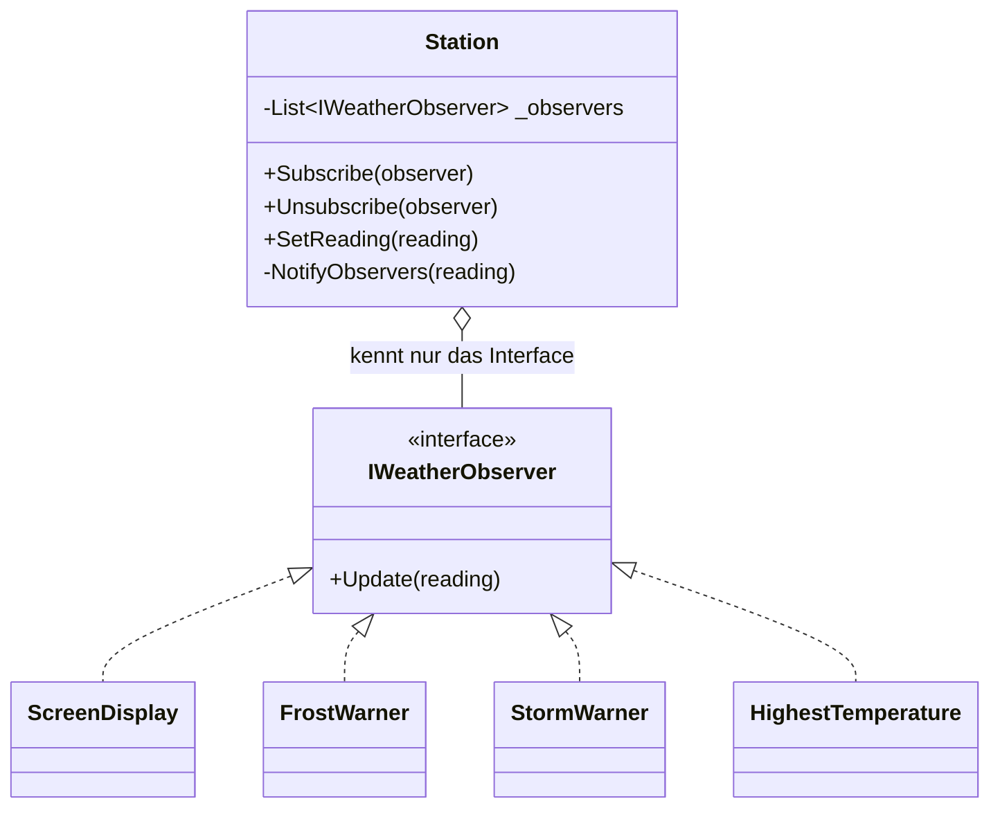
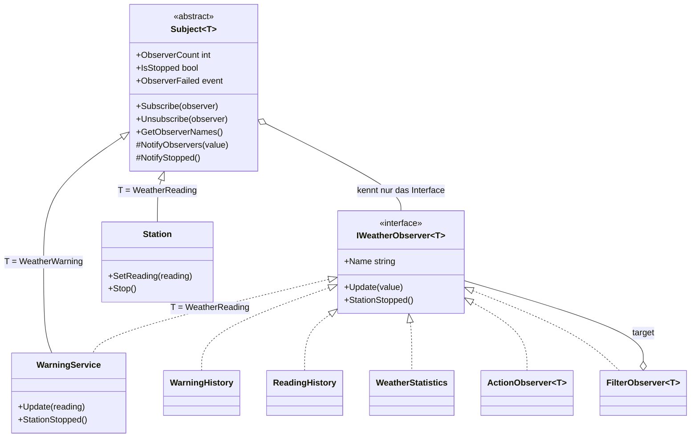
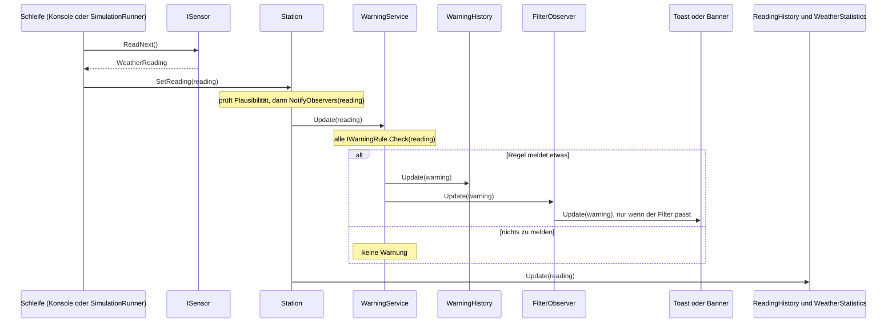
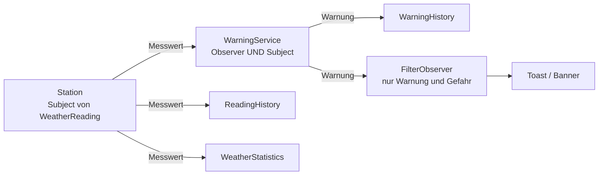

# Observer (Beobachter)

> Zurück zur [Übersicht (README)](../../README.md) · Weiter mit dem [Code-Rundgang](../CODE-RUNDGANG.md)

## In einem Satz

Ein **Subject** (das beobachtete Objekt) führt eine Liste von **Observern** (Zuhörern) und sagt ihnen automatisch Bescheid, sobald es etwas Neues gibt. Es muss die Zuhörer dafür nicht näher kennen.

### Der Alltagsvergleich: YouTube-Abo und Türklingel

Du willst wissen, wann dein Lieblings-YouTuber ein neues Video hochlädt. Du könntest alle fünf Minuten nachschauen. Das nervt. Besser: Du **abonnierst** den Kanal. Sobald es ein neues Video gibt, bekommst du eine Nachricht. Wenn du keine Lust mehr hast, **kündigst** du das Abo.

Der YouTuber weiß nicht, wer genau zuschaut oder was jeder mit dem Video macht. Er sagt nur: "Neues Video da!"

Noch ein Bild: die **Türklingel**. Du klingelst, und alle im Haus hören es. Wer gerade nicht zuhören will, stellt die Klingel leise (= abmelden). Der Klingelknopf muss nicht wissen, wer im Haus wohnt.

| Alltag | In diesem Projekt |
|---|---|
| YouTube-Kanal | `Station` (meldet neue Messwerte) |
| Abonnent | Observer, z. B. `ScreenDisplay`, `WarningHistory`, Blazor-Seite |
| Abonnieren | `station.Subscribe(observer)` |
| Kündigen | `station.Unsubscribe(observer)` |
| "Neues Video!" | `NotifyObservers(reading)` |

---

## Das Problem – so sähe der Code OHNE Pattern aus

Stell dir vor, die Station soll bei jedem neuen Messwert drei Dinge tun: die Anzeige aktualisieren, auf Frost prüfen und alles in eine Logdatei schreiben. Ohne Pattern schreibst du das einfach direkt hin:

```csharp
// AUSGEDACHTES Gegenbeispiel – so steht es NICHT im Projekt.
// (Show, Check, FileLogger gibt es dort nicht; es geht nur um die Idee.)
// So NICHT: Die Station kennt alle Empfänger und ruft sie direkt auf.
public class Station
{
    private readonly ScreenDisplay _display = new();
    private readonly FrostWarner _frostWarner = new();
    private readonly FileLogger _logger = new("wetter.log");

    public void SetReading(WeatherReading reading)
    {
        _display.Show(reading);
        _frostWarner.Check(reading);
        _logger.Write(reading);
    }
}
```

Das funktioniert. Es sieht sogar übersichtlich aus. Aber:

**Was passiert, wenn morgen ein SMS-Warner dazukommt?**
Du öffnest die Klasse `Station`, fügst ein Feld `_smsWarner` hinzu und eine Zeile in `SetReading`. Die **Aufgabe** der Station (Messwerte annehmen) hat sich gar nicht geändert, trotzdem musst du ihren Code anfassen.

Die konkreten Probleme:

- **Die Station kennt alle Empfänger.** Sie ist fest mit `ScreenDisplay`, `FrostWarner` und `FileLogger` verdrahtet. Das nennt man **enge Kopplung**.
- **Jeder neue Empfänger = Änderung an der Station.** Und damit die Gefahr, dass du etwas Funktionierendes kaputt machst.
- **Kein Abmelden zur Laufzeit.** Der Nutzer schließt das Fenster, die Anzeige soll nichts mehr bekommen? Du bräuchtest für jeden Empfänger ein `if (_displayEnabled)`.
- **Nicht testbar.** Willst du die Station testen, bekommst du automatisch eine echte Logdatei und echte Konsolenausgabe mit dazu.
- **Nicht wiederverwendbar.** Die Konsolen-App will keine SMS, die Web-App will Toasts. Du müsstest die Station kopieren und anpassen.
- **Ein Fehler zieht alles mit.** Wirft `_frostWarner.Check` eine Exception, kommt `_logger.Write` nie dran.

---

## Die Lösung – MIT Pattern

Die Station bekommt **eine Liste** von Zuhörern. Alle Zuhörer erfüllen denselben Vertrag, ein **Interface**. Die Station kennt nur diesen Vertrag, nicht die konkreten Klassen.

Das ist die Stufe-1-Fassung (`src/WeatherStation.Beginner`). Sie ist absichtlich klein.

**Der Vertrag** (`IWeatherObserver.cs`):

```csharp
public interface IWeatherObserver
{
    void Update(WeatherReading reading);
}
```

**Das Subject** (`Station.cs`):

```csharp
public class Station
{
    private readonly List<IWeatherObserver> _observers = new();

    public WeatherReading? Current { get; private set; }   // der letzte Messwert

    public int ObserverCount => _observers.Count;            // wie viele hören zu?

    public void Subscribe(IWeatherObserver observer)
    {
        ArgumentNullException.ThrowIfNull(observer);
        if (_observers.Contains(observer))
        {
            return; // doppelt anmelden bringt nichts
        }
        _observers.Add(observer);
    }

    public void Unsubscribe(IWeatherObserver observer)
    {
        ArgumentNullException.ThrowIfNull(observer);
        _observers.Remove(observer);
    }

    public void SetReading(WeatherReading reading)
    {
        ArgumentNullException.ThrowIfNull(reading);
        Current = reading;
        NotifyObservers(reading);
    }

    private void NotifyObservers(WeatherReading reading)
    {
        // Kopie, damit sich ein Observer während der Schleife abmelden darf.
        foreach (IWeatherObserver observer in _observers.ToList())
        {
            observer.Update(reading);
        }
    }
}
```

**Ein Observer** (`Observers/FrostWarner.cs`, hier ohne die Zeilen für die Textfarbe):

```csharp
public class FrostWarner : IWeatherObserver
{
    public int WarningCount { get; private set; }

    public void Update(WeatherReading reading)
    {
        if (reading.Temperature <= 0)
        {
            WarningCount++;
            Console.WriteLine($"[Frostwarner] Achtung Glätte! {reading.Temperature:0.0} °C um {reading.Time} Uhr");
        }
    }
}
```

**Anmelden** (`Program.cs`, gekürzt):

```csharp
var station = new Station();

var display = new ScreenDisplay();
var frostWarner = new FrostWarner();
var stormWarner = new StormWarner();
var highest = new HighestTemperature();

station.Subscribe(display);
station.Subscribe(frostWarner);
station.Subscribe(stormWarner);
station.Subscribe(highest);
```

Die Observer stehen in eigenen Variablen, weil das Programm sie später noch braucht: `display` zum Abmelden, `highest` und `frostWarner` für das Ergebnis am Ende.

Und der SMS-Warner von morgen? Eine neue Klasse `SmsWarner : IWeatherObserver` plus **eine** Zeile `station.Subscribe(new SmsWarner())`. An der `Station` ändert sich **nichts**. Das ist der ganze Gewinn.

### Wer liefert die Daten? (Push-Modell)

Bei uns **schickt** die Station den neuen Messwert gleich mit: `Update(reading)`. Das nennt man **Push-Modell** ("die Daten werden zum Observer geschoben"). Die andere Variante heißt **Pull-Modell**: Die Station ruft nur `Update()` ohne Daten auf, und jeder Observer holt sich den Wert selbst ab (z. B. über `station.Current`). Push ist einfacher, darum benutzen beide Stufen dieses Projekts Push.

---

## Schritt für Schritt: Was passiert beim Ausführen?

Wir nehmen den Stufe-1-Code und folgen einem Messwert (`new WeatherReading("00:00", -1.0, 35)`).

1. **Programmstart:** `new Station()` erzeugt eine Station mit einer leeren Liste `_observers`.
2. **Anmelden:** `station.Subscribe(display)` legt `display` in die Liste. Danach `frostWarner`, `stormWarner`, `highest`. Die Liste hat jetzt vier Einträge, `station.ObserverCount` ist 4.
3. **Neuer Messwert:** Das Programm ruft `station.SetReading(reading)` auf.
4. **Merken:** `SetReading` speichert den Wert in `Current`.
5. **Benachrichtigen:** `SetReading` ruft `NotifyObservers(reading)`. Diese Methode macht eine **Kopie** der Liste und geht sie der Reihe nach durch.
6. **Update:** Für jeden Eintrag wird `observer.Update(reading)` aufgerufen. Die Station weiß nicht, ob dahinter ein `ScreenDisplay` oder ein `FrostWarner` steckt. Sie kennt nur `IWeatherObserver`.
7. **Jeder reagiert auf seine Art:** Die Anzeige druckt eine Zeile. Der Frostwarner sieht -1,0 °C und gibt eine Warnung aus. Der Sturmwarner sieht 35 km/h und tut nichts. `HighestTemperature` merkt sich still den Wert.
8. **Abmelden:** Später ruft das Programm `station.Unsubscribe(display)` auf. Beim nächsten Messwert hat die Liste nur noch drei Einträge, die Anzeige schweigt.

> Probiere es aus: `dotnet run --project src/WeatherStation.Beginner`. In der Ausgabe siehst du genau diese Reihenfolge, und nach dem vierten Messwert verschwindet die `[Anzeige]`-Zeile.

---

## Die Rollen und wie die Klassen zusammenhängen

| GoF-Rolle | Bedeutung | Stufe 1 | Stufe 2 |
|---|---|---|---|
| **Subject** | Wird beobachtet, führt die Liste | `Station` | `Subject<T>` (Basisklasse), `Station`, `WarningService` |
| **Observer** (Interface) | Der Vertrag für Zuhörer | `IWeatherObserver` | `IWeatherObserver<T>` |
| **Konkreter Observer** | Reagiert auf die Meldung | `ScreenDisplay`, `FrostWarner`, `StormWarner`, `HighestTemperature` | `WarningHistory`, `ReadingHistory`, `WeatherStatistics`, `ReadingPrinter`, `WarningPrinter`, `ActionObserver<T>`, `FilterObserver<T>`, Blazor-Seiten |
| Anmelden | Abonnieren | `Subscribe(observer)` | `Subscribe(observer)` |
| Abmelden | Kündigen | `Unsubscribe(observer)` | `Unsubscribe(observer)` |
| Benachrichtigen | Alle informieren | `NotifyObservers(reading)` | `NotifyObservers(value)` |
| Zustand ändern | Auslöser der Meldung | `SetReading(reading)` | `SetReading(reading)` |

### Klassendiagramm Stufe 1



Der Pfeil mit der Raute (`o--`) heißt: "Die Station **hat** eine Liste von ...". Wichtig ist, was **nicht** im Diagramm steht: kein Pfeil von `Station` zu `FrostWarner`. Die Station kennt nur das Interface.

### Klassendiagramm Stufe 2



`WarningService` hat **zwei** Pfeile: Er erbt von `Subject<WeatherWarning>` (er ist Quelle) und implementiert `IWeatherObserver<WeatherReading>` (er ist Zuhörer). Dazu mehr im Abschnitt zur Kette weiter unten.

### Sequenzdiagramm: Ein Messwert wandert durchs System (Stufe 2)



So liest du das Diagramm: Die Zeit läuft von oben nach unten. Die Schleife holt einen Messwert beim Sensor ab und gibt ihn der Station. Die Station ruft ihre Observer **nacheinander** auf: zuerst den `WarningService` (der seinerseits seine eigenen Observer benachrichtigt), danach `ReadingHistory` und `WeatherStatistics` (in der Reihenfolge, in der der Builder sie angemeldet hat).

Die Station kennt weder die Historie noch den Toast. Sie kennt nur `IWeatherObserver<WeatherReading>`.

---

## Wo findest du es im Projekt?

### Stufe 1 (`src/WeatherStation.Beginner`)

| Was | Datei |
|---|---|
| Observer-Interface | `src/WeatherStation.Beginner/IWeatherObserver.cs` |
| Subject (Liste, Subscribe, Unsubscribe, NotifyObservers) | `src/WeatherStation.Beginner/Station.cs` |
| Vier konkrete Observer | `src/WeatherStation.Beginner/Observers/` (`ScreenDisplay`, `FrostWarner`, `StormWarner`, `HighestTemperature`) |
| Anmelden, Abmelden, Ablauf | `src/WeatherStation.Beginner/Program.cs` |
| Tests | `tests/WeatherStation.Tests/Beginner/BeginnerStationTests.cs` |

### Stufe 2 (Core, Konsole, Web)

| Was | Datei |
|---|---|
| Observer-Interface (generisch) | `src/WeatherStation.Core/Observer/IWeatherObserver.cs` |
| Subject-Basisklasse (Liste, Subscribe, Unsubscribe, Notify, Fehlerisolation) | `src/WeatherStation.Core/Observer/Subject.cs` |
| Observer aus Lambda | `src/WeatherStation.Core/Observer/ActionObserver.cs` |
| Filter-Hülle | `src/WeatherStation.Core/Observer/FilterObserver.cs` |
| Fehlerbeschreibung | `src/WeatherStation.Core/Observer/ObserverError.cs` |
| Konkretes Subject: Messwerte | `src/WeatherStation.Core/Services/Station.cs` |
| Observer **und** Subject | `src/WeatherStation.Core/Services/WarningService.cs` |
| Fertige Observer | `src/WeatherStation.Core/Observers/` (`WarningHistory`, `ReadingHistory`, `WeatherStatistics`) |
| Konsolen-Observer | `src/WeatherStation.ConsoleApp/Observers/` (`ReadingPrinter`, `WarningPrinter`) |
| Anmelden in der Konsole | `src/WeatherStation.ConsoleApp/WeatherConsole.cs` (`RunSimulation`, `ToggleReadingPrinter`) |
| Blazor-Seiten als Observer | `src/WeatherStation.Web/Components/Pages/*.razor`, `Components/Shared/WarningToaster.razor` |
| Experimente | `src/WeatherStation.Web/Components/Pages/ObserverLab.razor` (Seite `/observer-labor`) |
| Tests | `tests/WeatherStation.Tests/SubjectTests.cs`, `ActionObserverTests.cs`, `FilterObserverTests.cs`, `ObserversTests.cs`, `StationTests.cs`, `WarningServiceTests.cs` |

---

## Stufe 1 → Stufe 2: Was kommt dazu und warum?

Die Grundidee bleibt gleich. Die Namen auch: `Update`, `Subscribe`, `Unsubscribe`, `SetReading`, `NotifyObservers`. Wer Stufe 1 verstanden hat, erkennt alles wieder. Dazu kommen Dinge, die ein **echtes** Programm braucht. Jedes davon löst ein konkretes Problem.

| Neu in Stufe 2 | Problem, das es löst |
|---|---|
| **Generics:** `Subject<T>`, `IWeatherObserver<T>` | In Stufe 1 gibt es nur Messwerte. In Stufe 2 gibt es zwei Arten von Meldungen: Messwerte **und** Warnungen. Statt alles zu kopieren, schreiben wir die Basisklasse einmal für ein beliebiges `T`. |
| **`Name`** im Interface | Das Observer-Labor will anzeigen, wer gerade angemeldet ist. Dafür braucht jeder Observer einen lesbaren Namen. |
| **`StationStopped()`** | Wenn die Station aufhört, sollen alle das erfahren (z. B. Datei schließen). Ohne diese Methode wüsste ein Observer nie, dass nichts mehr kommt. |
| **Thread-Sicherheit** (`lock`, Copy-on-Write) | In der Web-App meldet ein Hintergrunddienst Messwerte, während Browser-Seiten sich gleichzeitig an- und abmelden. Eine normale `List<T>` würde dabei Exceptions werfen. *(FÜR FORTGESCHRITTENE)* |
| **Fehlerisolation** (`try/catch` + Event `ObserverFailed`) | In Stufe 1 bringt ein fehlerhafter Observer die ganze Schleife zum Absturz. In Stufe 2 bekommen die anderen ihre Meldung trotzdem, und der Fehler wird über das Event gemeldet. |
| **Replay** (`sendLastValueToNewObservers`) | Eine Seite, die sich neu anmeldet, soll sofort den letzten Messwert sehen und nicht bis zur nächsten Messung leer bleiben. |
| **Verkettung:** `WarningService` ist Observer **und** Subject | Aus Messwerten werden Warnungen. Die Warnungen haben wieder eigene Abonnenten. |
| **`FilterObserver<T>`** | Der Toast will nur Warnungen ab Stufe "Warnung". Statt in jedem Observer ein `if` zu schreiben, gibt es einen wiederverwendbaren Filter. |
| **`ActionObserver<T>`** | Für kleine Zuhörer lohnt sich keine eigene Klasse. Eine Lambda reicht. |

### So sieht `Subject<T>` im Kern aus

Das ist die Stufe-1-Station, nur generisch (`src/WeatherStation.Core/Observer/Subject.cs`, hier ohne die Sperren gekürzt):

```csharp
public abstract class Subject<T>
{
    protected Subject(bool sendLastValueToNewObservers = false) { ... }

    public void Subscribe(IWeatherObserver<T> observer) { ... }     // doppelt: ignoriert
    public void Unsubscribe(IWeatherObserver<T> observer) { ... }   // nicht angemeldet: nichts passiert

    protected void NotifyObservers(T value) { ... }   // ruft bei allen Update(value)
    protected void NotifyStopped() { ... }            // ruft bei allen StationStopped()
}
```

`Subscribe` und `Unsubscribe` sind `public` (jeder darf anmelden). `NotifyObservers` ist `protected` (nur die Klasse selbst und ihre Unterklassen dürfen es aufrufen): Nur das Subject selbst, also `Station` bzw. `WarningService`, darf Meldungen auslösen. `Subject<T>` ist `abstract`, du kannst also kein "nacktes" `new Subject<T>()` erzeugen, sondern nur Unterklassen davon. Das sieht man in `Station.SetReading`:

```csharp
public void SetReading(WeatherReading reading)
{
    // ... Prüfungen (Station gestoppt? Werte plausibel?) ...
    lock (_stateLock)
    {
        _lastReading = reading;
        _readingCount++;
    }

    NotifyObservers(reading);
}
```

### Fehlerisolation im Detail

Stell dir drei Observer vor, der mittlere wirft eine Exception. Bei Stufe 1 sieht die Schleife so aus:

```csharp
foreach (IWeatherObserver observer in _observers.ToList())
{
    observer.Update(reading);   // wirft der zweite -> der dritte bekommt nichts, die Station stürzt ab
}
```

In Stufe 2 fängt `Subject<T>` den Fehler **pro Observer** ab und meldet ihn:

```csharp
try
{
    observer.Update(value);
}
catch (Exception exception)
{
    ObserverFailed?.Invoke(new ObserverError(observer.Name, exception));
}
```

Wichtig: Der Fehler **verschwindet nicht still**. Er wird über das Event `ObserverFailed` sichtbar. Im Observer-Labor kannst du das live sehen.

### Verkettung: `WarningService` ist Observer **und** Subject

```csharp
public sealed class WarningService : Subject<WeatherWarning>, IWeatherObserver<WeatherReading>
```

- Als **Observer** von `WeatherReading` bekommt er die Messwerte der Station (`Update(reading)`).
- Als **Subject** von `WeatherWarning` meldet er erzeugte Warnungen an seine eigenen Abonnenten weiter.



Jedes Glied der Kette kennt nur das nächste über ein Interface. Das ist wie eine Postkette: Die Poststelle sortiert die Briefe (Messwerte) und gibt daraus gemachte Zettel (Warnungen) an die Abteilungen weiter.

### Der Filter als Hülle

Manchmal will ein Observer nur einen Teil der Meldungen. Der `FilterObserver<T>` packt einen anderen Observer ein wie eine Hülle:

```csharp
public sealed class FilterObserver<T> : IWeatherObserver<T>
{
    private readonly IWeatherObserver<T> _target;
    private readonly Func<T, bool> _filter;

    public string Name => _target.Name + " (gefiltert)";

    public void Update(T value)
    {
        if (_filter(value))
        {
            _target.Update(value);
        }
    }

    // "Station beendet" ist immer wichtig und wird nicht gefiltert.
    public void StationStopped() => _target.StationStopped();
}
```

Benutzung (Konsole, `src/WeatherStation.ConsoleApp/WeatherConsole.cs`, `RunSimulation`): Das Gefahren-Banner soll nur bei `Danger` erscheinen.

```csharp
var dangerBanner = new FilterObserver<WeatherWarning>(
    new ActionObserver<WeatherWarning>("Gefahren-Banner", PrintDangerBanner),
    warning => warning.Level == WarningLevel.Danger);
system.Warnings.Subscribe(dangerBanner);
```

Von innen nach außen gelesen: `PrintDangerBanner` ist eine normale Methode. `ActionObserver` macht daraus einen Observer. `FilterObserver` packt eine Bedingung davor. Erst dieses Gesamtpaket wird angemeldet.

Das Subject merkt nichts davon: Für `WarningService` ist der `FilterObserver` ein ganz normaler Observer. Das ist selbst wieder das Observer-Muster, kombiniert mit einer Hülle (in der Fachsprache: *Decorator*).

### `StationStopped()`

`station.Stop()` ruft intern `NotifyStopped()` auf, und das ruft bei **allen** angemeldeten Observern `StationStopped()` auf. Dabei leert das Subject seine Liste. Danach kommen keine Messwerte mehr: Ein weiteres `SetReading` wirft eine `InvalidOperationException`. Wer sich **nach** `Stop()` anmeldet, bekommt sofort `StationStopped()`.

Der `WarningService` reicht das Signal weiter: Seine Methode `StationStopped()` ruft selbst `NotifyStopped()` auf. So erfahren auch die Zuhörer des Warn-Dienstes (z. B. die `WarningHistory`), dass nichts mehr kommt.

### Replay des letzten Werts

`Station` ruft `base(sendLastValueToNewObservers: true)` auf. Wer sich später anmeldet, bekommt **sofort den letzten Messwert**. Deshalb ist eine Seite in der Web-App sofort gefüllt, wenn du sie öffnest.

Der `WarningService` macht das **nicht** (Standard ist `false`): Eine alte Warnung noch einmal als Toast zu zeigen wäre falsch. Wer alte Warnungen sehen will, fragt die `WarningHistory`.

### Hysterese: Warum Frost bei 0 °C, aber Entwarnung erst bei 1 °C?

Stell dir vor, es gäbe nur **eine** Grenze bei 0 °C. Die Temperatur schwankt durch Messrauschen um 0 herum. Die Warnmeldungen im Observer-Muster würden "flackern". Darum haben die Regeln zwei Grenzen:

| Messung | Temperatur | Nur eine Grenze (<= 0 warnt, > 0 entwarnt) | Mit Hysterese (Warnung <= 0,0; Entwarnung >= 1,0) |
|---|---|---|---|
| 1 | 0,1 °C | - | - |
| 2 | 0,0 °C | Frostwarnung | Frostwarnung (jetzt aktiv) |
| 3 | 0,1 °C | Entwarnung | - (noch aktiv, weil < 1,0) |
| 4 | 0,0 °C | Frostwarnung | - (schon aktiv) |
| 5 | 0,1 °C | Entwarnung | - |
| 6 | 1,2 °C | - | Entwarnung |

Mit Hysterese kommt genau **eine** Warnung und **eine** Entwarnung. Die Regel merkt sich dafür einen Zustand (`_isActive`), siehe `src/WeatherStation.Core/Rules/FrostRule.cs`. Das ist auch der Grund, warum `WarningService.Update` die Regeln unter einem `lock` prüft: Der Zustand darf nicht von zwei Threads gleichzeitig verändert werden.

---

## Typische Fehler

### 1. Vergessenes Abmelden = Speicherleck (Blazor)

Das Subject hält eine **Referenz** auf jeden Observer. Solange der Observer angemeldet ist, darf der Garbage Collector (die automatische Speicher-Aufräumung von .NET) ihn nicht löschen. In der Web-App leben `Station` und `WarningService` im `WeatherSystem`, und das ist als DI-Singleton registriert: Es lebt **für die ganze Laufzeit** der App.

Bei einer Blazor-Seite, die sich nicht abmeldet, passiert Folgendes:

- Sie bleibt für immer im Speicher (**Speicherleck**).
- Sie wird bei jedem Messwert weiter benachrichtigt, obwohl der Nutzer sie längst verlassen hat (**Updates an tote Komponenten**).
- Mit jedem Seitenbesuch kommt eine weitere Leiche dazu. Die Liste im Observer-Labor wächst.

Die Lösung steht in jeder Seite (hier `src/WeatherStation.Web/Components/Pages/Warnings.razor`): `IDisposable` implementieren und in `Dispose()` abmelden. Wichtig: Du musst das Observer-Objekt in einem **Feld** behalten, denn `Unsubscribe` braucht genau dasselbe Objekt.

```csharp
private IWeatherObserver<WeatherWarning>? _observer;
private bool _disposed;

protected override void OnInitialized()
{
    _observer = new ActionObserver<WeatherWarning>("Warnungen-Tabelle", warning => Refresh());
    Weather.Warnings.Subscribe(_observer);
}

public void Dispose()
{
    _disposed = true;
    Weather.Warnings.Unsubscribe(_observer!);   // ohne diese Zeile: Speicherleck
}
```

Das gilt auch für klassische .NET-Events (`ObserverFailed -= ...`). Übung dazu: Aufgabe 6 im README.

### 2. Exceptions in Observern

Wenn ein Observer in `Update` eine Exception wirft, sollen die anderen ihre Meldung trotzdem bekommen. Deshalb fängt `Subject<T>` jede Exception pro Observer und meldet sie über `ObserverFailed`. Ohne diesen Schutz legt ein einziger kaputter Observer die ganze Station lahm.

Gegenstück: **Schlucke Fehler nie still.** Ein leeres `catch { }` versteckt Bugs. Hier werden sie gemeldet.

### 3. Liste ändern, während sie durchlaufen wird

Klassischer Fehler: Ein Observer meldet sich **in** seiner `Update`-Methode selbst ab (z. B. "nach dem dritten Messwert reicht es mir"). Bei einer normalen `List<T>` und `foreach` gibt das eine `InvalidOperationException` ("Collection was modified").

Darum steht schon in Stufe 1 diese Zeile:

```csharp
foreach (IWeatherObserver observer in _observers.ToList())   // ToList() = Kopie!
```

Die Schleife läuft über eine **Kopie**. Mit der Originalliste dürfen sich Observer jederzeit an- und abmelden. In Stufe 2 macht `Subject<T>` dasselbe, nur thread-sicher (Copy-on-Write, siehe Quelltext, Abschnitt "FÜR FORTGESCHRITTENE"). Die Kehrseite: Wer sich während einer Benachrichtigung abmeldet, bekommt diese eine Meldung eventuell noch.

### 4. Hintergrund-Thread: `InvokeAsync` in Blazor

Die Meldungen kommen vom Hintergrund-Thread des `SimulationRunner`, **nicht** vom UI-Thread der Komponente. Eine Blazor-Komponente darf `StateHasChanged()` aber nur im eigenen Kontext aufrufen. Darum:

```csharp
InvokeAsync(() =>
{
    if (_disposed) return;   // Meldung war unterwegs, die Seite ist schon weg
    // Daten übernehmen ...
    StateHasChanged();
});
```

Das `_disposed`-Flag fängt den Fall ab, dass eine Meldung noch "unterwegs" ist, während die Komponente schon aufgeräumt wurde.

### 5. Weitere Stolpersteine

- **Lange Arbeit in `Update` bremst alle.** `NotifyObservers` ruft die Observer nacheinander im selben Thread auf. Ein langsamer Observer hält die anderen auf.
- **Die Reihenfolge ist nicht garantiert.** In diesem Projekt ist es die Anmeldereihenfolge, aber das Muster verspricht das nicht. Schreibe Observer so, dass sie nicht voneinander abhängen.
- **Endlosschleifen.** Ruft ein Observer in `Update` etwas auf, das wieder `SetReading` auslöst, dreht sich alles im Kreis.

---

## Vorteile / Nachteile

| Vorteile | Nachteile |
|---|---|
| **Lose Kopplung:** Das Subject kennt nur ein Interface. | **Schwerer zu verfolgen:** Wer reagiert wann? Der Ablauf steht nicht an einer Stelle, sondern ergibt sich aus der Anmeldeliste. |
| **Erweiterbar:** Neuer Observer = neue Klasse + eine Zeile `Subscribe`. Das Subject bleibt unverändert. | **Speicherlecks** bei vergessenem Abmelden. |
| **Zur Laufzeit änderbar:** An- und Abmelden jederzeit. | **Reihenfolge und Zeitpunkt** der Benachrichtigung sind nicht garantiert. |
| **Wiederverwendbar:** Dieselbe Station läuft in Konsole und Web. | **Fehler in Observern** können unbemerkt bleiben, wenn man sie nicht meldet. |
| **Testbar:** Im Test hängst du einen Fake-Observer an. | **Bei Threads** braucht man Locks und Vorsicht. |

---

## So heißt das in .NET / in der Praxis

In diesem Projekt (Stufe 1 und 2) heißen die Dinge **einfach**, damit du das Prinzip siehst. In der Praxis begegnest du denselben Ideen unter anderen Namen.

### Die Namen im Vergleich

| Dieses Projekt | .NET-Standard (`System`) | Bedeutung |
|---|---|---|
| `IWeatherObserver<T>` | `IObserver<T>` | der Zuhörer |
| `Subject<T>` | `IObservable<T>` (und in Rx: `Subject<T>`) | die Quelle |
| `Update(value)` | `OnNext(value)` | ein neuer Wert |
| `StationStopped()` | `OnCompleted()` | die Quelle ist fertig |
| (gibt es nicht) | `OnError(Exception)` | die Quelle meldet einen Fehler, danach kommt nichts mehr. Nicht verwechseln mit unserem `ObserverFailed`: Das meldet einen Fehler **in einem Observer**, nicht in der Quelle. |
| `Subscribe(observer)` | `Subscribe(observer)` | anmelden |
| `Unsubscribe(observer)` | `Dispose()` auf dem **Token** | abmelden |

Die .NET-Variante sieht so aus:

```csharp
public interface IObservable<out T> { IDisposable Subscribe(IObserver<T> observer); }

public interface IObserver<in T>
{
    void OnNext(T value);
    void OnError(Exception error);
    void OnCompleted();
}
```

Der große Unterschied: `Subscribe` gibt ein **Token** (`IDisposable`) zurück. Wer `Dispose()` aufruft, meldet sich ab. Das hat Vorteile (man muss das Subject nicht mehr kennen, und `using` funktioniert), ist für Einsteiger aber eine zusätzliche Hürde. Darum nutzt dieses Projekt `Unsubscribe`.

### Weitere Varianten, die du kennen solltest

- **C#-Events** (`event`, `+=`, `-=`): Das ist Observer **eingebaut in die Sprache**. `button.Click += Handler;` ist `Subscribe`, `-=` ist `Unsubscribe`. Auch hier gilt: Wer `+=` macht und nie `-=`, hat ein Speicherleck.
- **Rx (Reactive Extensions, `System.Reactive`):** Eine Bibliothek, die `IObservable<T>` mit vielen Filtern und Verknüpfungen (`Where`, `Select`, `Throttle`, ...) ausbaut. Unser `FilterObserver` ist die Mini-Version von `Where`.
- **Blazor `StateHasChanged`, WPF `INotifyPropertyChanged`, JavaScript `addEventListener`, Message Queues:** Alles Abwandlungen derselben Idee ("sag mir Bescheid, wenn sich etwas ändert").

---

## Teste dich selbst

<details>
<summary>1. Warum kennt die Station nur das Interface <code>IWeatherObserver</code> und nicht die konkreten Klassen?</summary>

Damit sie nicht geändert werden muss, wenn ein neuer Observer dazukommt. Neue Klasse schreiben, das Interface umsetzen, `Subscribe` aufrufen. Die Station bleibt unverändert (lose Kopplung).
</details>

<details>
<summary>2. Was passiert, wenn eine Blazor-Seite sich nicht in <code>Dispose()</code> abmeldet?</summary>

Das Subject (`Station` bzw. `WarningService`, beide leben als Teil des DI-Singletons `WeatherSystem` für die ganze Laufzeit) hält weiter eine Referenz auf den Observer der Seite und damit auf die Seite selbst. Sie wird nie vom Garbage Collector entfernt (Speicherleck) und wird weiter benachrichtigt, obwohl der Nutzer sie längst verlassen hat. Mit jedem Seitenbesuch kommt ein weiterer toter Observer dazu.
</details>

<details>
<summary>3. Warum läuft <code>NotifyObservers</code> über eine <em>Kopie</em> der Liste?</summary>

Ein Observer darf sich in `Update` selbst abmelden. Würde die Schleife über die Originalliste laufen, bekäme man eine `InvalidOperationException`, weil die Liste während des `foreach` verändert wird. Mit der Kopie ist das erlaubt.
</details>

<details>
<summary>4. Warum ist <code>WarningService</code> Observer <em>und</em> Subject? Was wäre die Alternative?</summary>

Er bekommt Messwerte (Observer von `WeatherReading`) und erzeugt daraus Warnungen, die er an eigene Abonnenten weitergibt (Subject von `WeatherWarning`). Alternative: Die Station würde die Regeln selbst prüfen und Warnungen verteilen. Dann hätte die Station zwei Aufgaben, und die Regeln wären nicht mehr austauschbar.
</details>

<details>
<summary>5. In <code>Update</code> eines Observers wird eine Exception geworfen. Was passiert in Stufe 1, was in Stufe 2?</summary>

Stufe 1: Die `foreach`-Schleife bricht ab. Alle Observer hinter dem fehlerhaften bekommen den Messwert nicht, und der Fehler läuft bis zum Aufrufer von `SetReading`. Stufe 2: `Subject<T>` fängt den Fehler pro Observer, meldet ihn über das Event `ObserverFailed` und macht mit dem nächsten Observer weiter.
</details>

<details>
<summary>6. Warum braucht man in Blazor <code>InvokeAsync(StateHasChanged)</code>, wenn ein Observer eine Meldung bekommt?</summary>

Die Meldung kommt aus dem Hintergrund-Thread des `SimulationRunner`. `StateHasChanged` darf in Blazor nur im UI-Kontext der Komponente aufgerufen werden. `InvokeAsync` wechselt dorthin.
</details>

<details>
<summary>7. Wie heißt <code>Update</code> im .NET-Standard-Interface <code>IObserver&lt;T&gt;</code>?</summary>

`OnNext`. Und `StationStopped` heißt dort `OnCompleted`. Zusätzlich gibt es `OnError`.
</details>
