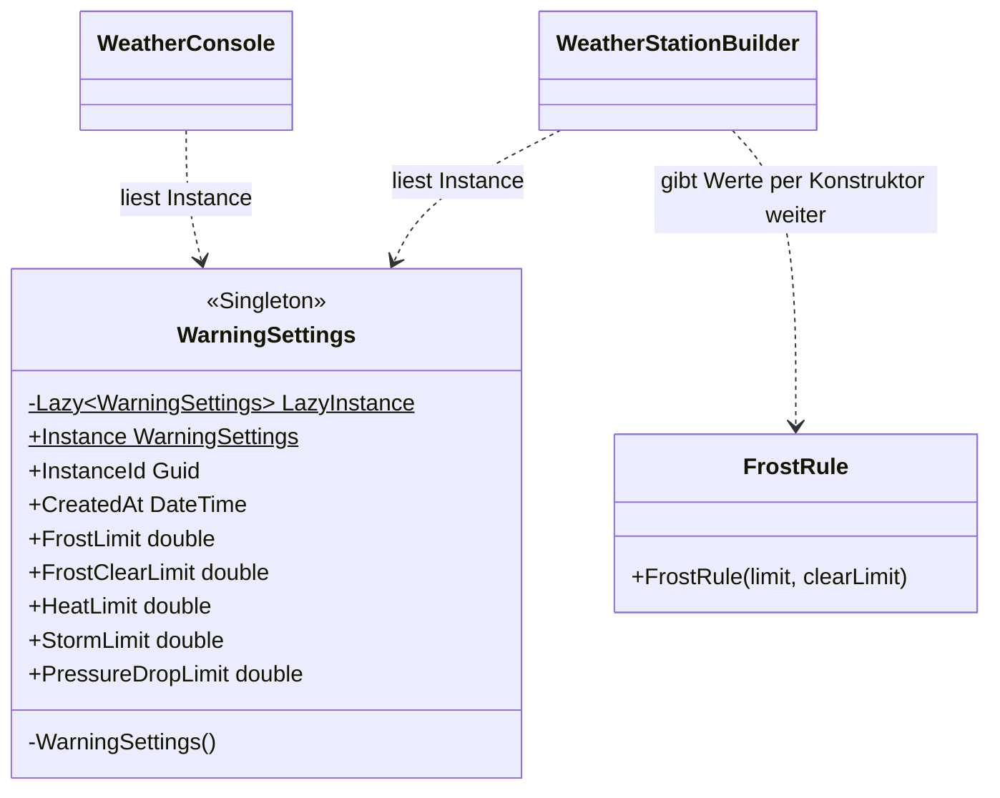

# Singleton (Einzelstück)

> Zurück zur [Übersicht (README)](../../README.md) · Siehe auch [Builder](Builder.md) · [Code-Rundgang](../CODE-RUNDGANG.md)

## In einem Satz

Von einer Klasse gibt es **genau eine Instanz** (ein Objekt), und es gibt einen **globalen Zugriffspunkt** darauf.

### Der Alltagsvergleich: Schul-Sekretariat und das eine Klassenbuch

Eure Schule hat **ein** Sekretariat. Wenn du eine Bescheinigung brauchst, gehst du dorthin. Es wäre Chaos, wenn jede Klasse ein eigenes Sekretariat mit eigenen Regeln hätte.

Oder: Pro Klasse gibt es **ein** Klassenbuch. Alle Lehrer tragen im selben Buch ein. Gäbe es drei Kopien, stünde in jeder etwas anderes, und keiner wüsste, welche stimmt.

| Alltag | In diesem Projekt |
|---|---|
| Das eine Sekretariat / Klassenbuch | `WarningSettings` (die Grenzwerte) |
| "Geh zum Sekretariat" | `WarningSettings.Instance` |
| Niemand darf ein zweites Sekretariat eröffnen | `private WarningSettings()` |
| Alle haben dieselben Öffnungszeiten | Frost bei 0 °C, Sturm ab 75 km/h, überall gleich |

---

## Das Problem – so sähe der Code OHNE Pattern aus

Die Grenzwerte (Frost bei 0 °C, Sturm ab 75 km/h, ...) sollen im **ganzen Programm dieselben** sein. Ohne Pattern gibt es zwei naheliegende Wege, und beide haben Haken.

**Weg 1: Die Werte überall durchreichen.**

```csharp
// AUSGEDACHTES Gegenbeispiel – so steht es NICHT im Projekt
// (den Builder-Konstruktor mit Grenzwerten gibt es nicht).
// So NICHT: Die Einstellungen wandern durch jede Methode.
void Run(double frostLimit, double frostClearLimit, double heatLimit, double heatClearLimit,
         double stormLimit, double stormClearLimit, double pressureLimit, TimeSpan pressureWindow)
{
    var builder = new WeatherStationBuilder(frostLimit, frostClearLimit, heatLimit, heatClearLimit,
                                            stormLimit, stormClearLimit, pressureLimit, pressureWindow);
    PrintLimits(frostLimit, frostClearLimit, heatLimit, heatClearLimit, stormLimit, stormClearLimit);
    // ...
}
```

**Weg 2: Jede Klasse legt ihre eigenen Werte an.**

```csharp
// AUSGEDACHTES Gegenbeispiel – stell dir eine Welt OHNE Singleton vor,
// in der WarningSettings einen öffentlichen Konstruktor hätte.
// So auch NICHT: Dieselben Zahlen stehen an mehreren Stellen.
public class FrostRule
{
    private const double Limit = 0.0;        // hier
    // ...
}

public class ConsolePrinter
{
    public void PrintLimits() => Console.WriteLine("Frost bei 0 °C");   // und hier noch einmal
}

public class SettingsPage   // Web
{
    private readonly WarningSettings _settings = new WarningSettings();   // eigene Instanz!
}
```

Die konkreten Probleme:

- **Weg 1 ist mühsam:** Jede Methode in der Aufrufkette trägt Parameter mit, die sie selbst gar nicht braucht, nur um sie weiterzureichen.
- **Weg 2 führt zu Widersprüchen:** Ändert jemand den Frost-Grenzwert auf 1 °C, aber vergisst die Konsolenausgabe, zeigt das Programm "Frost bei 0 °C" an und warnt bei 1 °C. Du hast dieselbe Wahrheit an mehreren Orten, und sie driftet auseinander.
- **Mehrere Instanzen:** Hat jede Seite ihr eigenes `new WarningSettings()`, hat jede ihre eigene Kopie. Eine Änderung an einer Kopie sehen die anderen nicht.
- **Was passiert, wenn morgen eine neue Seite die Grenzwerte braucht?** Entweder noch ein Parameter in der ganzen Kette oder noch eine weitere Kopie.
- **Verschwendung:** Falls die Instanz teuer zu erzeugen ist (Datei lesen, Datenbank), passiert das für jede Kopie neu.

---

## Die Lösung – MIT Pattern

Die Klasse sorgt **selbst** dafür, dass es nur eine Instanz gibt, und bietet einen festen Zugriffspunkt. `src/WeatherStation.Core/Settings/WarningSettings.cs`:

```csharp
public sealed class WarningSettings
{
    private static readonly Lazy<WarningSettings> LazyInstance = new(() => new WarningSettings());

    private WarningSettings()
    {
        InstanceId = Guid.NewGuid();
        CreatedAt = DateTime.Now;
    }

    public static WarningSettings Instance => LazyInstance.Value;

    public Guid InstanceId { get; }
    public DateTime CreatedAt { get; }

    public double FrostLimit { get; } = 0.0;
    public double FrostClearLimit { get; } = 1.0;
    // ... weitere Grenzwerte
}
```

Benutzen:

```csharp
WarningSettings settings = WarningSettings.Instance;   // überall dasselbe Objekt
```

Die Bausteine:

- **`private` Konstruktor:** Niemand außer der Klasse selbst kann `new WarningSettings()` schreiben. Der Compiler verbietet es.
- **`static ... Instance`:** Der **einzige** Weg an das Objekt. `static` heißt: Die Eigenschaft gehört zur Klasse, nicht zu einem Objekt. Du rufst sie also ohne `new` auf.
- **`Lazy<T>`:** Die Instanz entsteht **erst beim ersten Zugriff** und **thread-sicher genau einmal**, auch wenn mehrere Threads gleichzeitig zugreifen. (Mit dem hier benutzten Konstruktor `new Lazy<T>(() => ...)` ist das die Standard-Einstellung von `Lazy<T>`, `LazyThreadSafetyMode.ExecutionAndPublication`.)
- **`sealed`:** Von der Klasse darf niemand erben. Der private Konstruktor verhindert das zwar praktisch schon, `sealed` macht die Absicht aber auf den ersten Blick sichtbar: "Hier gibt es keine Unterklassen und damit auch keine zweite Art von Instanz."

**Beweis in der Praxis:** `InstanceId` ist eine zufällige Nummer (`Guid`), die bei der Erzeugung vergeben wird. Innerhalb **eines** laufenden Programms ist sie bei jedem Zugriff gleich:

- In der **Konsole** steht sie bei jedem Menü-Aufruf in der Zeile "Grenzwerte (Singleton, Instanz ...)". Starte mehrere Simulationen hintereinander: Die Nummer bleibt gleich.
- In der **Web-App** zeigt die Seite `/muster` die `InstanceId` an. Öffne die Seite in zwei Browser-Tabs oder lade sie neu: Die Nummer bleibt gleich, solange die App läuft.

Achtung: Konsole und Web-App sind **zwei verschiedene Programme** (zwei Prozesse). Jedes hat sein **eigenes** Singleton und damit eine **andere** `InstanceId`. "Genau eine Instanz" gilt immer nur pro laufendem Programm. Startest du das Programm neu, entsteht auch eine neue Instanz.

### Wichtig für die Testbarkeit: Wer liest das Singleton?

Die Regeln (z. B. `FrostRule`) lesen **nicht selbst** `WarningSettings.Instance`. Sie bekommen ihre Grenzwerte im Konstruktor. Nur der Builder liest das Singleton und reicht die Werte weiter:

```csharp
// WeatherStationBuilder.CreateRules()
WarningSettings settings = WarningSettings.Instance;
// ...
rules.Add(new FrostRule(settings.FrostLimit, settings.FrostClearLimit));
```

Dadurch kannst du `FrostRule` im Test mit eigenen Werten prüfen (`new FrostRule(0, 1)`), ohne dass globaler Zustand stört. Das Singleton wird also nur an **ganz wenigen Stellen** benutzt. Das ist die empfohlene Art, damit umzugehen.

---

## Schritt für Schritt: Was passiert beim Ausführen?

1. **Programmstart:** Noch gibt es **keine** Instanz. `LazyInstance` ist angelegt, aber leer (die Lambda `() => new WarningSettings()` wurde noch nicht ausgeführt).
2. **Erster Zugriff:** In der Web-App steht in `Program.cs` die Zeile `_ = WarningSettings.Instance;`. Dabei fragt `Instance` den Wert `LazyInstance.Value` ab. (In der Konsole ist der erste Zugriff `PrintLimits` beim ersten Anzeigen des Menüs.)
3. **Erzeugen:** `Lazy<T>` merkt: "Noch nichts da." Es ruft die Lambda auf, der **private** Konstruktor läuft (er darf, denn die Lambda steht **in** der Klasse). Er setzt `InstanceId = Guid.NewGuid()` und `CreatedAt = DateTime.Now`. Das fertige Objekt wird gespeichert.
4. **Zweiter und jeder weitere Zugriff** (z. B. in `WeatherStationBuilder.CreateRules()`): `Lazy<T>` gibt das **gespeicherte** Objekt zurück. Der Konstruktor läuft nie wieder.
5. **Zwei Threads gleichzeitig?** `Lazy<T>` stellt sicher, dass die Lambda **nur einmal** läuft. Der zweite Thread wartet kurz und bekommt dasselbe Objekt.
6. **Ergebnis:** Der Builder liest `FrostLimit` und `FrostClearLimit` und gibt sie an `new FrostRule(0.0, 1.0)`. Die Konsole liest in `PrintLimits` dieselbe Instanz. Die Seite `/muster` zeigt `InstanceId` und `CreatedAt`: überall derselbe Wert.

---

## Die Rollen und wie die Klassen zusammenhängen

| GoF-Rolle | Bedeutung | Klasse in diesem Projekt |
|---|---|---|
| **Singleton** | Die Klasse mit der einen Instanz | `WarningSettings` |
| **Zugriffspunkt** | Statischer Weg an die Instanz | `WarningSettings.Instance` |
| **Privater Konstruktor** | Verhindert weitere Instanzen | `private WarningSettings()` |
| **Lazy-Erzeugung** | Instanz erst beim ersten Zugriff, thread-sicher | `Lazy<WarningSettings>` |
| **Benutzer (Clients)** | Lesen die Werte | `WeatherStationBuilder`, `WeatherConsole.PrintLimits`, Seite `/muster` |



So liest du das Diagramm: `$` hinter einem Namen heißt `static` (gehört zur Klasse), `-` heißt `private`, `+` heißt `public`. Der gestrichelte Pfeil (`..>`) heißt "benutzt".

Beachte: Von `FrostRule` geht **kein** Pfeil zu `WarningSettings`. Genau das ist Absicht.

---

## Wo findest du es im Projekt?

| Was | Datei |
|---|---|
| Singleton | `src/WeatherStation.Core/Settings/WarningSettings.cs` |
| Liest die Werte | `src/WeatherStation.Core/Building/WeatherStationBuilder.cs` (`CreateRules`) |
| Anzeige in der Konsole | `src/WeatherStation.ConsoleApp/WeatherConsole.cs` (`PrintLimits`) |
| Start-Zugriff Web | `src/WeatherStation.Web/Program.cs` (`_ = WarningSettings.Instance;`) |
| Anzeige in der Web-App | Seite `/muster` (`src/WeatherStation.Web/Components/Pages/Patterns.razor`) |
| Tests | `tests/WeatherStation.Tests/WarningSettingsTests.cs` (u. a. "Instance_FromParallelTasks_AlwaysSameInstanceAndId") |

---

## Vorteile / Nachteile

| Vorteile | Nachteile |
|---|---|
| **Genau eine Wahrheit:** Alle sehen dieselben Werte. | **Globaler Zustand:** Von überall erreichbar. Bei veränderbaren Werten kann jeder alles überschreiben (bei uns sind alle Werte nur lesbar, `{ get; }`). |
| **Bequemer Zugriff** ohne Durchreichen. | **Versteckte Abhängigkeit:** Einer Klasse, die `Instance` benutzt, sieht man das von außen nicht an (der Konstruktor verrät es nicht). |
| **Lazy:** Wird nur erzeugt, wenn gebraucht. | **Schwer testbar:** Ein Test kann keine anderen Werte einsetzen, es gibt ja nur die eine Instanz. |
| **Thread-sicher** durch `Lazy<T>`. | **Verführt zum Missbrauch:** "Ich brauche gerade nur eine Instanz" ist kein Grund für ein Singleton. |
| | **Bindet die Klasse an ihre Rolle:** Die Klasse regelt selbst, dass es nur eine gibt, und vermischt dadurch zwei Aufgaben (Werte halten und Einzigkeit sichern). |

### Die Alternative: Dependency Injection

Heute löst man dasselbe Problem meist mit **Dependency Injection (DI)**. Die Klasse bekommt, was sie braucht, **von außen** (über den Konstruktor). Ein Container sorgt dafür, dass er nur **eine** Instanz herausgibt:

```csharp
// Program.cs der Web-App
builder.Services.AddSingleton<SimulationRunner>();
```

```csharp
// Die Klasse erklärt im Konstruktor offen, was sie braucht.
public SimulationRunner(WeatherSystem system, ILogger<SimulationRunner> logger)
```

Vorteil: Im Test baust du die Klasse mit `new` und gibst ihr einfach andere Werte oder ein Fake-Objekt. Und in der Signatur steht, was sie braucht (keine versteckte Abhängigkeit). Hier im Projekt lebt `WarningSettings` bewusst als **klassisches** Singleton, damit du das Muster in Reinform siehst und seine Nachteile kennenlernst.

---

## Typische Fehler

- **Naive Variante, nicht thread-sicher.** So sieht das Muster in vielen alten Büchern aus:

  ```csharp
  // So NICHT: Zwei Threads können gleichzeitig "null" sehen und zwei Instanzen erzeugen.
  public static WarningSettings Instance
  {
      get
      {
          if (_instance == null)
          {
              _instance = new WarningSettings();
          }
          return _instance;
      }
  }
  ```

  `Lazy<T>` löst das für dich.
- **Veränderbare Werte.** Mit `{ get; set; }` kann jede Stelle im Programm die Grenzwerte ändern, und niemand weiß, wer es war. Halte Singletons möglichst **unveränderlich**.
- **Singleton überall benutzen.** Je mehr Klassen `WarningSettings.Instance` direkt aufrufen, desto schwerer sind sie zu testen. Greife nur an wenigen Stellen zu (bei uns: im Builder) und reiche die Werte weiter.
- **Begriffsfalle: "DI-Singleton" ist nicht das Singleton-Muster.** Nicht verwechseln!
  - **GoF-Singleton** (`WarningSettings`): Die **Klasse selbst** erzwingt, dass es nur eine Instanz gibt (privater Konstruktor, statischer Zugriff).
  - **DI-Singleton** (`services.AddSingleton<...>` in `Program.cs`): Die Klasse ist ganz normal und hat einen öffentlichen Konstruktor. Der **Container** gibt nur eine Instanz heraus. Man könnte trotzdem weitere mit `new` bauen. Bei uns sind `WeatherSystem` und `SimulationRunner` DI-Singletons.
- **Nicht alles, was einmal vorkommt, ist ein Singleton.** Dass du im Moment nur eine Instanz brauchst, ist noch kein Grund für einen globalen Zugriffspunkt.

---

## So heißt das in .NET / in der Praxis

| Begriff | Was ist das? | Beispiel |
|---|---|---|
| **GoF-Singleton** | Klasse erzwingt selbst die eine Instanz. | `WarningSettings.Instance` |
| **`Lazy<T>`** | Baustein für thread-sichere, verzögerte Erzeugung. Das ist die empfohlene Art, ein Singleton in C# zu schreiben. | `Lazy<WarningSettings>` |
| **DI `AddSingleton`** | Der Container erzeugt **eine** Instanz für die ganze Lebensdauer der App. | `services.AddSingleton<SimulationRunner>()` |
| **`AddScoped` / `AddTransient`** | Die anderen DI-Lebensdauern: eine Instanz pro "Scope" (bei normalen Web-Anfragen: pro HTTP-Anfrage, in Blazor Server: pro Verbindung eines Browser-Tabs) bzw. bei jedem Anfordern eine neue. | |
| **Statische Klasse** (`static class`) | Sieht ähnlich aus (global erreichbar), ist aber **kein** Singleton: Es gibt nie ein Objekt, man kann sie nicht als Interface übergeben. | `Math`, `Console` |

In vielen echten Projekten nimmt man **fast immer** DI-Singleton statt GoF-Singleton. Das GoF-Singleton ist der historische Ursprung, den du kennen solltest, aber nur sparsam einsetzen.

---

## Teste dich selbst

<details>
<summary>1. Wie verhindert die Klasse <code>WarningSettings</code>, dass jemand eine zweite Instanz erzeugt?</summary>

Durch den `private` Konstruktor. Niemand außerhalb der Klasse kann `new WarningSettings()` schreiben. Die einzige Instanz liegt in `LazyInstance` und ist über `WarningSettings.Instance` erreichbar.
</details>

<details>
<summary>2. Wozu dient <code>Lazy&lt;T&gt;</code>? Was wäre ohne passiert?</summary>

Es erzeugt die Instanz erst beim ersten Zugriff und garantiert dabei, dass auch bei mehreren Threads nur eine entsteht. Ohne wäre die naive `if (_instance == null)`-Variante nicht thread-sicher: Zwei Threads könnten zwei Instanzen erzeugen.
</details>

<details>
<summary>3. Warum bekommt <code>FrostRule</code> seine Grenzwerte im Konstruktor, statt <code>WarningSettings.Instance</code> zu lesen?</summary>

Damit sie testbar bleibt. Im Test kann man `new FrostRule(0, 1)` mit eigenen Werten bauen, ohne vom globalen Zustand abzuhängen. Außerdem sieht man am Konstruktor, was die Regel braucht (keine versteckte Abhängigkeit).
</details>

<details>
<summary>4. Was ist der Unterschied zwischen <code>WarningSettings</code> und <code>services.AddSingleton&lt;SimulationRunner&gt;()</code>?</summary>

`WarningSettings` ist ein klassisches GoF-Singleton: Die Klasse selbst erzwingt eine Instanz (privater Konstruktor). `AddSingleton` ist nur eine **Lebensdauer im DI-Container**: Die Klasse ist normal, der Container gibt eine Instanz heraus. Man kann den `SimulationRunner` im Test trotzdem mit `new` bauen.
</details>

<details>
<summary>5. Nenne zwei Nachteile des Singleton-Musters.</summary>

Globaler Zustand (von überall erreichbar und ggf. veränderbar), versteckte Abhängigkeiten, schwere Testbarkeit, die Klasse hat zwei Aufgaben (ihre Fachlogik und die Einzigkeit).
</details>

<details>
<summary>6. Woran erkennst du in der Web-App, dass es wirklich dieselbe Instanz ist?</summary>

An der `InstanceId`: Sie wird bei der Erzeugung vergeben und ist bei jedem Zugriff gleich. Die Seite `/muster` zeigt sie an.
</details>
